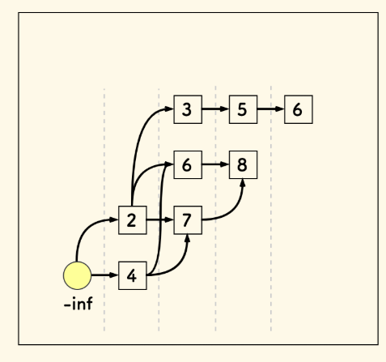
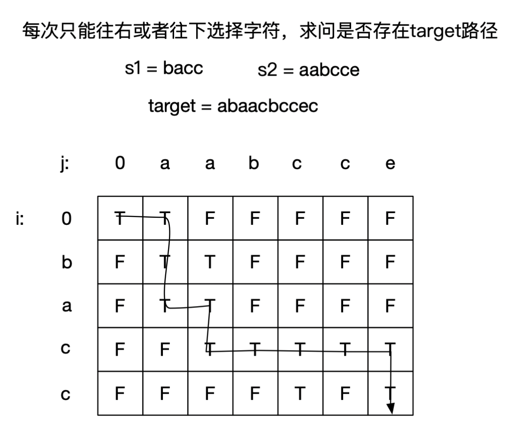

# LeetCode 算法笔记

服务于机考

## 常用工具包

#### 二分查找

注：在以下算法中，`if` 递归条件中改为非严格符号，就能处理有相同元素时的问题

##### 查找给定值，存在则返回索引，否则返回-1：

```python
# 迭代版本
def binary_search(nums, target):
    left, right = 0, len(nums) - 1
    while left <= right:
        mid = (left + right) // 2
        if nums[mid] == target:
            return mid
        elif nums[mid] < target:
            left = mid + 1
        else:
            right = mid - 1
    return -1
# 递归版本
def binary_search(nums, target, left, right):
    if left > right:
        return -1
    mid = (left + right) // 2
    if nums[mid] == target:
        return mid
    elif nums[mid] < target:
        return binary_search(nums, target, mid + 1, right)
    else:
        return binary_search(nums, target, left, mid - 1)
```

```c++
// 迭代版本
int binarySearch(vector& nums, int target) {
    int left = 0, right = nums.size() - 1;
    while (left <= right) {
        int mid = left + (right - left) / 2;
        if (nums[mid] == target) {
            return mid;
        } else if (nums[mid] < target) {
            left = mid + 1;
        } else {
            right = mid - 1;
        }
    }
    return -1;
}
// 递归版本
int binarySearch(vector& nums, int target, int left, int right) {
    if (left > right) {
        return -1;
    }
    int mid = left + (right - left) / 2;
    if (nums[mid] == target) {
        return mid;
    } else if (nums[mid] < target) {
        return binarySearch(nums, target, mid + 1, right);
    } else {
        return binarySearch(nums, target, left, mid - 1);
    }
}
```

##### 查找比给定值小的最大元素（下界）:

```python
# 迭代版本
def find_lower_bound(nums, target):
    left, right = 0, len(nums) - 1
    i = len(nums)  # 初始化假设所有元素都小于target
    while left <= right:
        mid = (left + right) // 2
        if nums[mid] >= target:
            i = mid
            right = mid - 1
        else:
            left = mid + 1
    return i - 1 if i != 0 else -1
# 递归版本
def find_lower_bound(nums, target, left, right):
    if left > right:
        return right  # 返回比target小的最大元素的索引
    mid = (left + right) // 2
    if nums[mid] >= target:
        return find_lower_bound(nums, target, left, mid - 1)
    else:
        return find_lower_bound(nums, target, mid + 1, right)
```

```c++
// 迭代版本
int findLowerBound(vector& nums, int target) {
    int left = 0, right = nums.size() - 1;
    int i = nums.size();  // 初始化假设所有元素都小于target
    while (left <= right) {
        int mid = left + (right - left) / 2;
        if (nums[mid] >= target) {
            i = mid;
            right = mid - 1;
        } else {
            left = mid + 1;
        }
    }
    return i == 0 ? -1 : i - 1;
}
// 递归版本
int findLowerBound(vector& nums, int target, int left, int right) {
    if (left > right) {
        return right;  // 返回比target小的最大元素的索引
    }
    int mid = left + (right - left) / 2;
    if (nums[mid] >= target) {
        return findLowerBound(nums, target, left, mid - 1);
    } else {
        return findLowerBound(nums, target, mid + 1, right);
    }
}
```

##### 查找比给定值大的最小元素（上界）:

```python
# 迭代版本
def find_upper_bound(nums, target):
    left, right = 0, len(nums) - 1
    i = len(nums)  # 初始化假设所有元素都小于等于target
    while left <= right:
        mid = (left + right) // 2
        if nums[mid] > target:
            i = mid
            right = mid - 1
        else:
            left = mid + 1
    return i if i != len(nums) else -1
# 递归版本
def find_upper_bound(nums, target, left, right):
    if left > right:
        return left if left < len(nums) else -1  # 返回比target大的最小元素的索引
    mid = (left + right) // 2
    if nums[mid] > target:
        return find_upper_bound(nums, target, left, mid - 1)
    else:
        return find_upper_bound(nums, target, mid + 1, right)
```

```c++
// 迭代版本
int findUpperBound(vector& nums, int target) {
    int left = 0, right = nums.size() - 1;
    int i = nums.size();  // 初始化假设所有元素都小于等于target
    while (left <= right) {
        int mid = left + (right - left) / 2;
        if (nums[mid] > target) {
            i = mid;
            right = mid - 1;
        } else {
            left = mid + 1;
        }
    }
    return i != nums.size() ? i : -1;
}
// 递归版本
int findUpperBound(vector& nums, int target, int left, int right) {
    if (left > right) {
        return left < nums.size() ? left : -1;  // 返回比target大的最小元素的索引
    }
    int mid = left + (right - left) / 2;
    if (nums[mid] > target) {
        return findUpperBound(nums, target, left, mid - 1);
    } else {
        return findUpperBound(nums, target, mid + 1, right);
    }
}
```

#### 链表快慢指针

##### 取链表中点

```python
while fast and fast.next:
	fast, slow = fast.next.next, slow.next
mid = slow.next
```

```c++
while (fast != nullptr && fast->next != nullptr) {
    fast = fast->next->next;
    slow = slow->next;
}
ListNode* mid = slow->next;
```

##### 找环形入口

```python
pass
```

```c++
2
```

[287. 寻找重复数 - 力扣（LeetCode）](https://leetcode.cn/problems/find-the-duplicate-number/)

#### 数组元素的相互抵消运算

异或运算：[136. 只出现一次的数字 - 力扣（LeetCode）](https://leetcode.cn/problems/single-number/)

摩尔投票：[169. 多数元素 - 力扣（LeetCode）](https://leetcode.cn/problems/majority-element/description/)

### 滑动窗口

滑动窗口仅适用于单调数组，即右扩展

[76. 最小覆盖子串 - 力扣（LeetCode）](https://leetcode.cn/problems/minimum-window-substring/description)

### 单调栈

​	在 $O(n)$ 内解决 “ 左 / 右边下一个更大 / 更小元素 ” 问题（广义：在一维数组中找第一个满足某种条件的数）：

- 单调递增栈：从栈顶到栈底递增（口诀：**递增栈找第一大**）
  - 满足递增：入栈时判断栈顶是否比自己**小**，如果是则弹出；直到**栈空**或栈顶**不小于**自身，入栈
  - 当从左到右顺序遍历入栈时，入栈前的元素就是**左边第一个比自己大的元素**
- 单调递减栈：从栈顶到栈底递减（口诀：**递减栈找第一小**）
  - 入栈时判断栈顶是否比自己**大**
  - 如果是则弹出，直到栈顶**不大于**自身，入栈
  - 当从左到右顺序遍历入栈时，入栈前的元素就是**左边第一个比自己小的元素**

​	单调栈是非常好用的数据结构，为了避免脑子卡住：

- 先记住口诀：减小增大（顺着的）

- 再记模板：单调栈三部曲

  ```python
  12
  ```

  ```c++
  while 栈非空 and 单调性不满足（这里是排除，排除不严格结果就严格）:
  	出栈
  if 栈空:	边界处理
  esle: r[i]=栈顶
  无条件入栈 a[i]
  ```

- 然后理解：单调栈的精髓在于**单向遮盖**：对于从左向右遍历的递减栈来说，当它遇到一个值，栈中所有比它大的值都会被踢出，这个值就相当于遮盖了它左边所有比它大的值，标记出了新的左侧下界，但又保留了比自己更小的值

（一般在实际应用中维护的是索引，结果序列的初试默认值为 -1，最终值为 -1 则代表没有，也就是单向极值）：

```python
def next_greater(nums):
    greater_stack = []
    answer = [-1]*len(nums)	# 初始化全 -1
    for i in range(len(nums)):
        while greater_stack and nums[i]>nums[greater_stack[-1]]: # 栈底在末位
            index = greater_stack.pop()
            answer[index] = nums[i]
        greater_stack.append(i)
    return answer
```

```c++
vector nextGreater(vector& nums) {
    stack greaterStack;
    vector answer(nums.size(), -1);  // 初始化全 -1
    for (int i = 0; i < nums.size(); i++) {
        while (!greaterStack.empty() && nums[i] > nums[greaterStack.top()]) { // 栈底在末位
            int index = greaterStack.top();
            greaterStack.pop();
            answer[index] = nums[i];
        }
        greaterStack.push(i);
    }
    return answer;
}
```

:star:[42. 接雨水 - 力扣（LeetCode）](https://leetcode.cn/problems/trapping-rain-water/description)

思路：按列求，每次只关注一列（而不是块区域，这个聚焦思想很重要），一个列能够接雨水的量：取决于：`min(左边的最高值，右边的最高值）-当前列高`，于是我们只需要获得：

- 向左看的最高列数组`l`
- 向右看的最高列数组`r`
- 本列的高度输入（输入）`a`

​	就可以得到答案数组`res[i]=min(l[i],r[i])-a[i]`，对 `res` 的所有非 0 项求和即可

```python
def trap(height):
    n = len(height)
    h = 0
    l, r, res = [0] * n, [0] * n, [0] * n
    for i in range(n):
        l[i] = h
        if height[i] > h:
            h = height[i]
    h = 0
    for i in range(n-1, -1, -1):
        r[i] = h
        if height[i] > h:
            h = height[i]
    ans = 0
    for i in range(n):
        res[i] = min(l[i], r[i]) - height[i]
        if res[i] > 0:
            ans += res[i]
    return ans
```

```c++
int trap(vector<int>& height) {
    int n = height.size();
    int h = 0;
    vector<int> l(n), r(n), res(n);
    for(int i=0;i<n;i++){
        l[i] = h;
        if(height[i]>h) h = height[i];
    }
    h = 0;
    for(int i=n-1;i>=0;i--){
        r[i] = h;
        if(height[i]>h) h = height[i];
    }
    int ans = 0;
    for(int i=0;i<n;i++){
        res[i]=min(l[i], r[i]) - height[i];
        if(res[i]>0) ans+=res[i];
    }
    return ans;
}
```

[84. 柱状图中最大的矩形 - 力扣（LeetCode）](https://leetcode.cn/problems/largest-rectangle-in-histogram/description)

经典单调栈题目

```python
def largestRectangleArea(self, heights):
    # 对于i列，矩形大小为：左边最远不小于自己的，右边最远不小于自己的
    n = len(heights)
    if n == 0:
        return heights[0]  
    s = []
    left, right = [0] * n, [0] * n       
    # 从左往右，找左边严格小,严格单调递减栈
    for i in range(n):
        while s and heights[s[-1]] >= heights[i]:
            s.pop()
        left[i] = -1 if not s else s[-1]
        s.append(i)
    s = []
    # 从右往左，找右边严格小,严格单调递减栈
    for i in range(n-1, -1, -1):
        while s and heights[s[-1]] >= heights[i]:
            s.pop()
        right[i] = n if not s else s[-1]
        s.append(i)
    # 计算答案
    maxa = 0
    for i in range(n):
        maxa = max(maxa, heights[i] * (right[i] - left[i] - 1))  
    return maxa
```

```c++
int largestRectangleArea(vector<int>& heights) {
    // 对于i列，矩形大小为：左边最远不小于自己的，右边最远不小于自己的
    int n = heights.size();
    if(n==0) return heights[0];
    stack<int> s;
    vector<int> left(n), right(n);
    // 从左往右，找左边严格小,严格单调递减栈
    for(int i=0;i<n;i++){
        while(!s.empty() && heights[s.top()]>=heights[i])	s.pop();
        if(s.empty())   left[i] = -1;
        else    left[i] = s.top();
        s.push(i); 
    }
    while(!s.empty()) s.pop();
    // 从右往左，找右边严格小,严格单调递减栈
    for(int i=n-1;i>=0;i--){
        while(!s.empty() && heights[s.top()]>=heights[i])	s.pop();
        if(s.empty())   right[i] = n;
        else    right[i] = s.top();
        s.push(i); 
    }
    // 计算答案
    int maxa = 0;
    for(int i=0;i<n;i++){
        maxa = max(maxa, heights[i]*(right[i]-left[i]-1));
    }
    return maxa;
}
```

[739. 每日温度 - 力扣（LeetCode）](https://leetcode.cn/problems/daily-temperatures/description)

单调栈经典例题，提醒一下：单调栈经常存储的是**下标**，而属性信息则使用下标查表

```python
pass
```

```c++
vector<int> dailyTemperatures(vector<int>& temperatures) {
    int n = temperatures.size();
    vector<int> ans(n, 0);
    stack<int> s; // 只存储索引，不需要结构体
    for (int i = n - 1; i >= 0; i--) {
        while (!s.empty() && temperatures[i] >= temperatures[s.top()])	s.pop();
        if (!s.empty())	ans[i] = s.top() - i;
        s.push(i);
    }
    return ans;
}
```

四道同思路的拓展题：

[402. 移掉 K 位数字 - 力扣（LeetCode）](https://leetcode.cn/problems/remove-k-digits/description/)

[316. 去除重复字母 - 力扣（LeetCode）](https://leetcode.cn/problems/remove-duplicate-letters/)

[581. 最短无序连续子数组 - 力扣（LeetCode）](https://leetcode.cn/problems/shortest-unsorted-continuous-subarray/description/)

#### 单调队列

[239. 滑动窗口最大值 - 力扣（LeetCode）](https://leetcode.cn/problems/sliding-window-maximum/description)

#### 前缀和

[560. 和为 K 的子数组 - 力扣（LeetCode）](https://leetcode.cn/problems/subarray-sum-equals-k/description)

[437. 路径总和 III - 力扣（LeetCode）](https://leetcode.cn/problems/path-sum-iii/description)


### 动态规划

### DP 问题分类大观

| 问题特征                                                     | 可能类型     |
| ------------------------------------------------------------ | ------------ |
| 涉及数组/字符串的**单个序列**操作，状态与序列位置直接相关（仅依赖序列前驱） | **线性DP**   |
| 涉及**两个序列**的匹配或比较                                 | **双序列DP** |
| **选择物品**且有**容量限制**，状态定义中包含容量维度         | **背包问题** |
| 操作对象是**区间或子序列**（需枚举分割点）                   | **区间DP**   |
| 问题在**树形结构**上操作                                     | **树形DP**   |
| 存在多个**互斥状态**，状态间有明确的转移规则。               | **状态机DP** |

#### 线性 DP

**核心特点**：状态与序列位置直接相关

**经典问题**：最长递增子序列（LIS）、最大子数组和

🎯 **状态定义套路**：

- `dp[i]`：**以第 i 个元素结尾**的某种最优解

##### 连续子数组问题

🎯 **状态定义**：`dp[i]`：以第 i 个元素结尾的最大子数组和

**状态转移**：`dp[i]=max(nums[i], dp[i-1] + nums[i])`：要么尾追，要么单开

**空间优化**：因为只关注前驱，只保留 `pre` 即可

[53. 最大子数组和 - 力扣（LeetCode）](https://leetcode.cn/problems/maximum-subarray/description)

**问题**：找出一个具有最大和的连续非空子数组

```python
pass
```

```c++
int maxSubArray(vector<int>& nums) {
    vector<int> dp(nums.size());
    dp[0] = nums[0];
    int maxn = dp[0];
    for(int i=1;i<nums.size();i++){
        dp[i] = max(nums[i],dp[i-1]+nums[i]);
        if(maxn<dp[i]) maxn=dp[i];
    }
    return maxn;
}
```


[152. 乘积最大子数组 - 力扣（LeetCode）](https://leetcode.cn/problems/maximum-product-subarray/description)

**问题**：找出一个具有最大乘积的连续非空子数组

```python
pass
```

```c++
int maxProduct(vector<int>& nums) {
    int n = nums.size();
    vector<int> dp(n, 0), neg(n,0);
    dp[0] = nums[0], neg[0]=nums[0];
    int res = dp[0];
    for(int i=1;i<n;i++){
        if(nums[i]>0){
            neg[i] = min(neg[i-1]*nums[i], nums[i]); // 默认neg是负数
            dp[i] = max(dp[i-1]*nums[i], nums[i]);
        }   
        else{
            neg[i] = min(dp[i-1]*nums[i], nums[i]); // 默认dp是负数
            dp[i] = max(neg[i-1]*nums[i],dp[i-1]*nums[i]);
        }
        if(res<dp[i]) res = dp[i];
    }
    return res;
}
```

##### 最长递增子序列问题 LIS

最基础的暴力 DP：

```python
def lengthOfLIS(nums):
    dp = [1] * len(nums)  # dp[i]：以nums[i]结尾的最长递增子序列长度
    for i in range(len(nums)):
        for j in range(i):
            if nums[j] < nums[i]:
                dp[i] = max(dp[i], dp[j] + 1)
    return max(dp)
```

```c++
c
```

基础模型：**二分法求 LIS 长度**：

​	维护 `p` 数组：`p[i]`：长度为 `i+1` 的递增子序列的最末尾元素中的**最小值**（最小值的用意直观上是为了找上升得最慢的子序列），且显然 `p` 是递增的

- 遍历主数组，若当前 `t[i]` 元素大于 `p[-1]`，则把该元素追加到 `p` 后：`p.append(t[i])`
- 若当前 `t[i]` 元素小于 `p[-1]`，说明找到了更慢的上升子序列，则更新 `p`，覆盖掉 `p` 中大于 `t[i]` 的最小元素（二分查找）
- 最终返回 `p` 的长度

[300. 最长递增子序列 - 力扣（LeetCode）](https://leetcode.cn/problems/longest-increasing-subsequence/description)

万能建模：DAG 模型，可用于 LIS 进阶问题



​	建模思路：

- 数据结构：二维数组，每一层用一个列表，每个列表内部是有序的
- 构建过程：对于每个元素 `s[i]`，由于每个层的最小元素都在顶部，所以可以只看顶部就知道自己能不能和前面的层构成递增关系，即插入到下界后的有序表中
- 层间联系：图上的边实际上并不需要真的存储，因为边描述的是递增关系，递增关系可以在需要的时候通过遍历查询

用法：

**求最长递增子序列的个数**

​	思路：子序列个数 = 到达子序列末节点的路径个数，每次插入新元素，都需要检查前一层队列中，是自己前驱的个数和，元素构造为：`val, num`


[673. 最长递增子序列的个数 - 力扣（LeetCode）](https://leetcode.cn/problems/number-of-longest-increasing-subsequence)

**俄罗斯套娃信封问题**

​	LIS 问题的二维延伸，特点在于，你可以按照其中一个特征排序，另一个特征就会无序，随后在无序的特征维上做 LIS


​	排序中有个细节，却是点睛之笔，如果两个信封宽度相等，要按高度逆序排序 。 无论宽高，当严格大于时，才可以认为装的下。在宽相等的多个信封中，LIS 求解时只能取一个。 此时的局部逆序，则保证了 LIS 序列中最多从中取一个

​	更多的，还有三维衍生问题：

[面试题 08.13. 堆箱子 - 力扣（LeetCode）](https://leetcode.cn/problems/pile-box-lcci/description/)


##### 逆序问题

**核心特点**：状态转移方向与常规顺序相反，通常是因为当前状态的计算需要依赖后面的状态（反过来说，就是当前的决定是根据其对后续造成的影响来判断的）


[2140. 解决智力问题 - 力扣（LeetCode）](https://leetcode.cn/problems/solving-questions-with-brainpower)

```python
def mostPoints(self, questions: List[List[int]]) -> int:
    n = len(questions)
    dp=[0]*(n+1) # 最后一个作为0哨兵
    for i in range(n-1,-1,-1):
        dp[i] = max(dp[i+1],questions[i][0]+dp[min(n,i+questions[i][1]+1)])
    return dp[0]
```

```c++
long long mostPoints(vector<vector<int>>& questions) {
    int n = questions.size();
    vector<long long> dp(n+1, 0); // 最后一个作为0哨兵
    for(int i=n-1;i>=0;i--){
        dp[i]=max(dp[i+1], dp[min(n, i + questions[i][1] + 1)]+questions[i][0]);
    }
    return dp[0];
}
```


##### 双序列问题

**核心特点**：

- 操作对象是**两个序列**（如字符串、数组）
- 通常涉及**匹配、对比、转换**操作（如最长公共子序列、编辑距离）

**经典问题**：最长公共子序列、编辑距离

🎯 **状态定义套路**：

- `dp[i][j]`：表示处理到**第一个序列的第 i 个元素**和**第二个序列的第 j 个元素**时的最优解

##### 双序列表格法

常用技巧：字符串填充前导 0 或前导空，便于边界处理

[72. 编辑距离 - 力扣（LeetCode）](https://leetcode.cn/problems/edit-distance/description/)


[97. 交错字符串 - 力扣（LeetCode）](https://leetcode.cn/problems/interleaving-string/?envType=study-plan-v2&envId=top-interview-150)



[1035. 不相交的线 - 力扣（LeetCode）](https://leetcode.cn/problems/uncrossed-lines)

[1143. 最长公共子序列 - 力扣（LeetCode）](https://leetcode.cn/problems/longest-common-subsequence)


##### 二维线性问题

**核心特点**：

- 问题场景在**二维网格**中（如矩阵、棋盘）
- 移动方向受限（通常只能向右/向下）

**状态定义套路**：

- **`dp[i][j]`**: 表示到达网格位置`(i,j)`时的最优解（如路径数、最小代价）

#### 区间DP：子区间最优解

**核心特点**：操作对象是区间，最外层循环是子区间长度，下一层循环是子区间起点

**经典问题**：矩阵连乘、回文子串、戳气球

🎯 **状态定义套路**：`dp[i][j]`：区间 `[i,j]` 上的最优解

🎯 **状态转移套路**：`dp[i,j] = max/min{dp[i,j], dp[i, k] + dp[k+1, j] + cost}`

##### 回文串类型

[5. 最长回文子串 - 力扣（LeetCode）](https://leetcode.cn/problems/longest-palindromic-substring/)

```python
pass
```

```c++
string longestPalindrome(string s) {
    // dp[i][j]: s[i..j] 是回文串
    // dp[i][j] = dp[i+1][j-1], s[i]==s[j]
    int n = s.size();
    vector<vector<bool>> dp(n, vector<bool>(n, false));
    int resi=0, reslen=1;
    for(int i=0;i<n;i++) dp[i][i]=true;
    for(int len=2;len<=n;len++){
        for(int i=0;i<=n-len;i++){
            int j = i+len-1;
            if(s[i]==s[j]){
                if(i==j-1)  dp[i][j]=true; //len=2的情况
                else dp[i][j] = dp[i+1][j-1];
            }  
            if(dp[i][j] && j-i+1>reslen){
                reslen = j-i+1;
                resi = i;
            }
        }
    }
    return s.substr(resi, reslen);
}
```

[516. 最长回文子序列 - 力扣（LeetCode）](https://leetcode.cn/problems/longest-palindromic-subsequence/description/)

```python
pass
```

```c++
int longestPalindromeSubseq(string s) {
    int n = s.size();
    vector<vector<int>> dp(n,vector<int>(n,0));
    for(int i=0;i<n;i++) dp[i][i]=1;
    for(int len=2;len<=n;len++){
        for(int i=0;i<=n-len;i++){
            int j = i+len-1;
            if(s[i]==s[j])  dp[i][j]=dp[i+1][j-1]+2;
            else    dp[i][j]=max(dp[i][j-1],dp[i+1][j]);
        }
    }
    return dp[0][n-1];
}
```

[1312. 让字符串成为回文串的最少插入次数 - 力扣（LeetCode）](https://leetcode.cn/problems/minimum-insertion-steps-to-make-a-string-palindrome/description/)

```python
pass
```

```c++
int minInsertions(string s) {
    int n = s.size();
    vector<vector<int>> dp(n,vector<int>(n,0));
    for(int len=2;len<=n;len++){
        for(int i=0;i<=n-len;i++){
            int j = i+len-1;
            if(s[i]==s[j])  dp[i][j]=dp[i+1][j-1];
            else    dp[i][j]=min(dp[i][j-1],dp[i+1][j])+1;
        }
    }
    return dp[0][n-1];
}
```


##### 分割点类型

[312. 戳气球 - 力扣（LeetCode）](https://leetcode.cn/problems/burst-balloons/description/)

```python
pass
```

```c++
int maxCoins(vector<int>& nums) {
    // 我也不知道为什么是区间dp
    // dp[i][j]: 考虑开子区间的最优解
    // dp[i][k]: k 是最后一个戳爆的气球
    nums.insert(nums.begin(),1);
    nums.push_back(1);
    int n = nums.size();
    vector<vector<int>> dp(n+1, vector<int>(n+1, 0));
    for(int len=2;len<n;len++) // 区间dp特点：最外层是区间长度
        for(int i=0;i<n-len;i++)
            for(int k=i+1;k<i+len;k++)
                dp[i][i+len] = max(dp[i][i+len], 
                                   dp[i][k]+nums[i]*nums[k]*nums[i+len]+dp[k][i+len]);

    return dp[0][n-1];
}
```

[1000. 合并石头的最低成本 - 力扣（LeetCode）](https://leetcode.cn/problems/minimum-cost-to-merge-stones/description/)

```python
pass
```

```c++
int mergeStones(vector<int>& stones, int k) {
    // 区间dp
    int n = stones.size();
    if((n-1)%(k-1)!=0) return -1;

    vector<int> prefix(n+1,0);// 计算前缀和，便于计算代价
    for(int i=0;i<n;i++)    prefix[i + 1] = prefix[i] + stones[i];

    vector<vector<int>> dp(n, vector<int>(n,99999));
    for(int i=0;i<n;i++) dp[i][i] = 0;

    for(int len=2;len<=n;len++){
        for(int i=0;i<=n-len;i++){
            int j = i+len-1;
            for(int p=i;p<j;p+=k-1)    // 尝试所有可能的分割点
                dp[i][j] = min(dp[i][j], dp[i][p] + dp[p+1][j]);
            // 如果当前区间长度满足可以合并成一堆的条件，加上合并的成本
            if ((j - i) % (k - 1) == 0)
                dp[i][j] += prefix[j + 1] - prefix[i];
        }
    }
    return dp[0][n-1];
}
```


#### 背包问题：选择与容量

**核心特点**：物品选择 + 容量限制（在有约束的情况下，对某个元素**要么拿要么不拿**）

**经典问题**：01背包、完全背包、分割等和子集

🎯 **状态定义套路**：`dp[i][w]`：前 i 个物品，容量为 w 时的最优解（实际定义数组需要以 n+1 和 w+1 为尺寸）

🎯 **状态转移套路**：背包问题特点：最外层循环是背包容量，下一层循环是物品

**空间优化**：

- 常用一维数组`dp[w]`：发现`dp[i][w]`的计算仅依赖上一行`dp[i-1][...]`的值，因此可以用一维数组滚动更新，**覆盖旧状态**。（01背包覆盖通常需要**从右向左更新**，反向遍历；而完全背包正向遍历）
- 优化前，`i` 的遍历范围是`[1,n]`，`dp` 数组的尺寸是 `[n+1][p+1]`；优化后 `i` 的遍历范围是 `[0,n-1]`，`dp` 数组的尺寸是 `[p+1]`
- 优化前，需要判断背包余量和物品重量的关系（二维表格全遍历，存在物品重量大于余量的情况，需要复制之前的结果）；而优化后不需要（只遍历物品重量到余量，自动跳过无法取的情况，之前的结果只是不被覆盖，不需要显式复制），实际上空间优化的同时也优化了时间开销（复杂度相同）

##### 0-1 背包

**核心特点**：有 n 种物品，每种物品只有一个，每个物品有自己的重量和价值

**关键难点**：难点在于问题转化，不会那么直白得提问，需要化归

🎯 **状态转移套路**：

- 拿不下就不拿：`if(j<w[i]) dp[i][j]=dp[i-1][j]`
- 拿得下再决定：`else dp[i][j]=g(dp[i-1][j], dp[i-1][j-w[i]]+v[i])`，其中 `g` 是价值函数，用于衡量拿和不拿哪一个状态对目标有利，常见有：`max`，`min`，`||`，`+`
- 求值：`dp[i][j]=max(dp[i-1][j],dp[i-1][j-w[i]]+v[i])`

[416. 分割等和子集 - 力扣（LeetCode）](https://leetcode.cn/problems/partition-equal-subset-sum/description)

**问题**：能否将数组分割成两个和相等的子集？

- **问题分析**：寻找是否存在和为 `sum/2` 的子集
- **状态定义**：`dp[i][j]` 表示前 `i` 个数字中选出和为 `j` 的存在性。
- **状态转移方程**：
  - 拿不下就不拿：`if(j<nums[i-1]) dp[i][j]=dp[i-1][j];`
  - 拿得下再决定拿不拿：`else dp[i][j] = dp[i-1][j] || dp[i-1][j-nums[i-1]];`

- **最终目标**：`do[n][p]`
- **边界条件与限制**：`dp[0][0]=true` 和 `sum` 必须是偶数

```python
pass
```

```c++
bool canPartition(vector<int>& nums) {
    int sum = 0, n=nums.size();
    for(int i=0;i<n;i++) sum+=nums[i];
    if(sum%2!=0) return false;
    int p = sum/2;
    vector<vector<int>> dp(n+1,vector<int>(p+1,false));
    dp[0][0]=true;
    for(int i=1;i<=n;i++){
        for(int j=0;j<=p;j++){
            if(j<nums[i-1]) dp[i][j]=dp[i-1][j];
            else dp[i][j] = dp[i-1][j] || dp[i-1][j-nums[i-1]];
        }
    }
    return dp[n][p];
}
```

- **空间优化**：`dp[i][j]` 仅依赖于 `dp[i-1][j]` 和 `dp[i-1][j-nums[i-1]]`，即上一行的数据
  - `dp[j]`：容量为 `j` 时的可行性
  - `dp[j] = dp[j] || dp[j-nums[i]];`

```python
pass
```

```c++
bool canPartition(vector<int>& nums) {
    int sum = 0, n=nums.size();
    for(int i=0;i<n;i++) sum+=nums[i];
    if(sum%2!=0) return false;
    sum/=2;
    vector<int> dp(sum+1,false);
    dp[0]=true;
    for(int i=0;i<n;i++){
        for(int j=sum;j>=nums[i];j--){
            dp[j] = dp[j] || dp[j-nums[i]];
        }
    }
    return dp[sum];
}
```

[494. 目标和 - 力扣（LeetCode）](https://leetcode.cn/problems/target-sum/)

**问题**：`nums `每个数字前添加 `+` 或 `-`，使得表达式的运算结果等于 `target`，求共有多少种组合方式

- **问题分析**：设正数子集为 P，负数子集为 N；已知：
  - `P-N=target`
  - `P+N=sum(nums)`
  - 联立得：`P=(target+sum(nums))/2`，将问题转化为：在数组中选取若干数，使得它们的和等于 `P`（01 背包）
- **状态定义**：`dp[i][j]`表示前 `i` 个数字中选出和为 `j` 的方案数。
- **状态转移方程**：
  - 当 `j` 小于 `nums[i]` 时，不选择：`dp[i][j] = dp[i-1][j]`
  - 否则，合并是否选择的结果：`dp[i][j] = dp[i-1][j]+dp[i-1][j - nums[i]]`
- **最终目标**：`dp[n][p]`
- **边界条件与限制**：
  - **必要条件**：`target+sum(nums)` 必须是非负偶数，且 `sum(nums)>=target`
  - **初始化**：`dp[0][0]=1`（空集合和为0的方案数为1）

```python
pass
```

```c++
int findTargetSumWays(vector<int>& nums, int target) {
    int n = nums.size();
    int p=0;
    for(int i=0;i<n;i++) p+=nums[i]; 
    if(p<target) return 0;
    p += target;
    if(p%2!=0 || p<0) return 0;
    p/=2;
    vector<vector<int>> dp(n+1, vector<int>(p+1,0));
    dp[0][0]=1; // 空组和为0，相当于有一种方案 
    for(int i=1;i<=n;i++){
        for(int j=0;j<=p;j++){
            if(j<nums[i-1]) dp[i][j]=dp[i-1][j]; //没法选
            else dp[i][j]=dp[i-1][j]+dp[i-1][j-nums[i-1]]; //不选这个数方案数+选这个数方案数
        }
    }
    return dp[n][p];
}
```

- **空间优化**：`dp[i][j]` 仅依赖于 `dp[i-1][j]` 和 `dp[i-1][j-nums[i-1]]`，即上一行的数据
  - `dp[j]`：容量为 `j` 时的方案数
  - `dp[j]=dp[j]+dp[j-nums[i]];`

```python
pass
```

```c++
int findTargetSumWays(vector<int>& nums, int target) {
    // `P=(target+sum(nums))/2`
    // 将问题转化为：在数组中选取若干数，使得它们的和等于 `P`（01 背包）
    int n = nums.size();
    int p=0;
    for(int i=0;i<n;i++) p+=nums[i]; 
    if(p<target) return 0;
    p += target;
    if(p%2!=0 || p<0) return 0;
    p/=2;
    vector<int> dp(p+1,0);
    dp[0]=1; // 空组和为0，相当于有一种方案 
    for(int i=0;i<n;i++){
        for(int j=p;j>=nums[i];j--){
            dp[j]=dp[j]+dp[j-nums[i]]; //不选这个数方案数+选这个数方案数
        }
    }
    return dp[p];
}
```

[474. 一和零 - 力扣（LeetCode）](https://leetcode.cn/problems/ones-and-zeroes/description/)

**问题**：给定一个二进制字符串数组 `strs` 和两个整数 `m` 和 `n`，分别表示允许使用的 `0` 和 `1` 的最大数量。要求找出并返回能组成的最大子集的大小，该子集中 `0` 和 `1` 的数量不超过 `m` 和 `n`。

（当你已经熟悉了 0-1 背包的空间优化，就应该直接把它作为入手点了，不需要再从普通情况入手，无非就三部曲：1.背包里面没有 i，2.容量倒序，3.下界为物品重量)

（注意，并不是所有背包问题都可以空间优化，当且仅当不存在多维约束（标准背包）且不用记录路径的问题可以）

- **问题分析**：题目中给出了两个费用，这是**二维 0-1 背包问题**
- **状态定义**：`dp[j][k]` 表示使用 `j` 个 `0` 和 `k` 个 `1` 时能组成的最大子集大小
- **状态转移**：对于每个字符串，统计其 `0` 的数量 `zeros` 和 `1` 的数量 `ones`
- **最终目标**：`dp[m][n]`
- **边界条件与限制**：`dp[0][0]=0`

```python
pass
```

```c++
int findMaxForm(vector<string>& strs, int m, int n) {
    vector<vector<int>> dp(m+1,vector<int>(n+1,0));
    dp[0][0]=0;
    for(int i=0;i<strs.size();i++){
        int zero =0, one=0;
        for(int j=0;j<strs[i].size();j++){
            if(strs[i][j]=='0') zero++;
            else one++;
        }
        for(int j=m;j>=zero;j--){
            for(int k=n;k>=one;k--){
                dp[j][k]=max(dp[j][k], dp[j-zero][k-one]+1);
            }
        }
    }
    return dp[m][n];
}
```

##### 完全背包

**核心特点**：有 n 种物品，每种物品可以重复使用，每个物品有自己的重量和价值

**关键难点**：难点在于问题转化，不会那么直白得提问，需要化归

🎯 **状态转移套路**：

- 拿不下就不拿：`if(j<w[i]) dp[i][j]=dp[i-1][j]`
- 拿得下再决定：`else dp[i][j]=g(dp[i-1][j], dp[i-1][j-w[i]]+v[i])`，其中 `g` 是价值函数，用于衡量拿和不拿哪一个状态对目标有利，常见有：`max`，`min`，`||`
- 求值：`dp[i][j]=max(dp[i-1][j],dp[i-1][j-w[i]]+v[i])`
- 空间优化：与 0-1 背包不同，因为完全背包允许重复选择，所以允许覆盖，可以正序更新

[322. 零钱兑换 - 力扣（LeetCode）](https://leetcode.cn/problems/coin-change/description/)

**问题**：假设有无限数量的硬币，面额为 `coins`，需要凑出总金额 `amount`。求最少需要多少枚硬币？

- **问题分析**：经典的完全背包，“无限数量” 求 “最少”
- **状态定义**：`dp[i][j]`表示前 `i` 种硬币中凑出金额为 `w` 的最少硬币数。
- **状态转移方程**：
  - 当 `j` 小于 `coins[i-1]` 时，不选择：`dp[i][j] = dp[i-1][j]`
  - 否则，比较决定是否选择：`dp[i][j] = min(dp[i-1][j],dp[i][j-coins[i-1]] + 1)`
- **最终目标**：`dp[n][p]`
- **边界条件与限制**：
  - **初始化**：`dp[0][0]=0`，`dp[0][j]=INT_MAX`

```python
pass
```

```c++
int coinChange(vector<int>& coins, int amount) {
    int n = coins.size();
    vector<vector<int>> dp(n+1,vector<int>(amount+1,INT_MAX-1));
    dp[0][0]=0;
    for(int i=1;i<=n;i++){ //遍历物品
        for(int j=0;j<amount+1;j++){ //遍历容量
            if(j<coins[i-1]) dp[i][j]=dp[i-1][j];
            else dp[i][j]=min(dp[i-1][j], dp[i][j-coins[i-1]]+1);
        }
    }
    return dp[n][amount]==INT_MAX-1? -1 : dp[n][amount];
}
```

- **空间优化**：`dp[i][j]` 仅依赖于 `dp[i-1][j]` 和 `dp[i][j - coins[i-1]]`
  - `dp[j]`：凑出金额 `j` 所需的最少硬币数
  - `dp[j] = min(dp[j],dp[j - coins[i]]+1)`，正序更新

```python
pass
```

```c++
int coinChange(vector<int>& coins, int amount) {
    vector<int> dp(amount+1,INT_MAX-1);
    dp[0]=0;
    for(int i=0;i<coins.size();i++){ //遍历物品
        for(int j=coins[i];j<amount+1;j++){ //遍历容量
            dp[j]=min(dp[j], dp[j-coins[i]]+1);
        }
    }
    return dp[amount]==INT_MAX-1? -1 : dp[amount];
}
```

[139. 单词拆分 - 力扣（LeetCode）](https://leetcode.cn/problems/word-break/description/)

```python
pass
```

```c++
bool wordBreak(string s, vector<string>& wordDict) {
    // dp[i]:考虑前i个字母的结果
    int n = s.size();
    vector<bool> dp(n+1, false);
    dp[0] = true;
    for(int i=0;i<=n;i++){ // 遍历容量
        for (const string& word : wordDict) { // 遍历物品
            int len = word.size();  // 检查长度是否足够，且子串匹配
            if (i >= len && dp[i - len] && s.substr(i - len, len) == word) {
                dp[i] = true;
                break; // 找到一个可行解即可跳过其他单词
            }
        }
    }
    return dp[n];
}
```

[279. 完全平方数 - 力扣（LeetCode）](https://leetcode.cn/problems/perfect-squares/)

```python
pass
```

```c++
c
```

[518. 零钱兑换 II - 力扣（LeetCode）](https://leetcode.cn/problems/coin-change-ii/description/)

```python
pass
```

```c++
int change(int amount, vector<int>& coins) {
    int n = coins.size();
    vector<double> dp(amount+1, 0);
    dp[0] = 1;
    for(int i=0;i<n;i++){
        for(int j=coins[i];j<=amount;j++)
            dp[j]=dp[j] + dp[j-coins[i]];
    }
    return dp[amount];
}
```

- [879. 盈利计划 - 力扣（LeetCode）](https://leetcode.cn/problems/profitable-schemes/)


#### 状态机 DP

**核心特点**：问题中存在**多个互斥的状态**，且每个状态会根据操作切换到另一个状态，形成清晰的**状态转移图**。例如，股票买卖中的「持有」和「不持有」状态，打家劫舍中的「偷」和「不偷」状态。

🎯 **状态定义套路**

1. **定义状态维度**：
   - `dp[i][s]`: 表示在第 `i` 个阶段（如第i天）处于状态 `s` 时的最优解。
   - 状态 `s` 通常用数字或布尔值表示（如 `0` 和 `1` 表示是否持有股票）。
2. **多维状态扩展**：
   - 若存在额外限制（如交易次数），需增加维度：`dp[i][k][s]`。
   - **示例**：股票买卖IV中，`dp[i][k][1]` 表示第i天已交易k次且持有股票的最大利润。

🎯 **状态转移套路**

1. **绘制状态转移图**：
   - 明确每个状态如何转换到其他状态。
   - **示例**（含冷冻期的股票买卖）：
     - 状态 `0`（不持有，非冷冻期）← 保持不持有 或 从冷冻期转移
     - 状态 `1`（持有） ← 保持持有 或 从不持有状态买入
     - 状态 `2`（冷冻期） ← 从持有状态卖出
2. **状态转移方程**：
   - 根据状态转移图，为每个状态写出递推式。

**空间优化**：

1. **滚动数组压缩**：若当前状态仅依赖前一状态，可用变量代替数组。
2. **降维处理**：
   - 若状态维度较高但部分维度可合并，可减少维度。
   - **示例**：当交易次数 `k` 较大时，可压缩为奇偶滚动（如 `dp[2][k]`）。


##### 一维动态规划

- 启蒙题：
  - [70. 爬楼梯 - 力扣（LeetCode）](https://leetcode.cn/problems/climbing-stairs/description)
  - [198. 打家劫舍 - 力扣（LeetCode）](https://leetcode.cn/problems/house-robber/)


#### 数学技巧

##### 矩阵旋转

旋转 90° 公式：$m[i][j]=m[j][n-1-i]$
