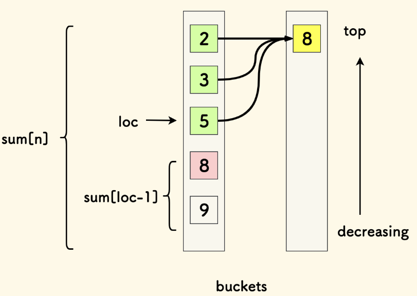
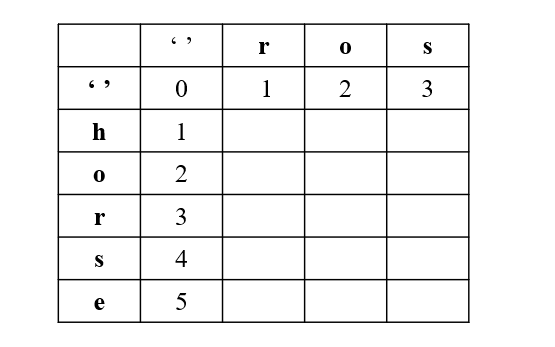
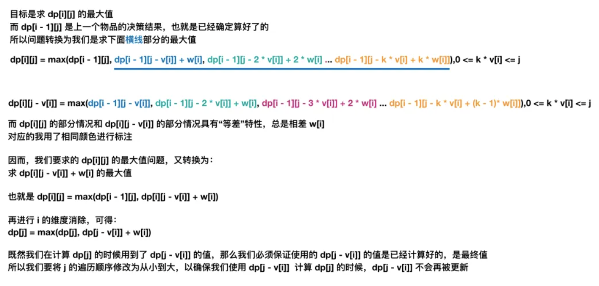

# LeetCode 算法笔记

自用算法笔记，服务于机考；可以当作题单使用

## 工具类

### 二分查找

注：在以下算法中，`if` 递归条件中改为非严格符号，就能处理有相同元素时的问题

##### 查找给定值，存在则返回索引，否则返回-1：

```python
# 迭代版本
def binary_search(nums, target):
    left, right = 0, len(nums) - 1
    while left <= right:
        mid = (left + right) // 2
        if nums[mid] == target:
            return mid
        elif nums[mid] < target:
            left = mid + 1
        else:
            right = mid - 1
    return -1
# 递归版本
def binary_search(nums, target, left, right):
    if left > right:
        return -1
    mid = (left + right) // 2
    if nums[mid] == target:
        return mid
    elif nums[mid] < target:
        return binary_search(nums, target, mid + 1, right)
    else:
        return binary_search(nums, target, left, mid - 1)
```

```c++
// 迭代版本
int binarySearch(vector& nums, int target) {
    int left = 0, right = nums.size() - 1;
    while (left <= right) {
        int mid = left + (right - left) / 2;
        if (nums[mid] == target) {
            return mid;
        } else if (nums[mid] < target) {
            left = mid + 1;
        } else {
            right = mid - 1;
        }
    }
    return -1;
}
// 递归版本
int binarySearch(vector& nums, int target, int left, int right) {
    if (left > right) {
        return -1;
    }
    int mid = left + (right - left) / 2;
    if (nums[mid] == target) {
        return mid;
    } else if (nums[mid] < target) {
        return binarySearch(nums, target, mid + 1, right);
    } else {
        return binarySearch(nums, target, left, mid - 1);
    }
}
```

##### 查找比给定值小的最大元素（下界）:

```python
# 迭代版本
def find_lower_bound(nums, target):
    left, right = 0, len(nums) - 1
    i = len(nums)  # 初始化假设所有元素都小于target
    while left <= right:
        mid = (left + right) // 2
        if nums[mid] >= target:
            i = mid
            right = mid - 1
        else:
            left = mid + 1
    return i - 1 if i != 0 else -1
# 递归版本
def find_lower_bound(nums, target, left, right):
    if left > right:
        return right  # 返回比target小的最大元素的索引
    mid = (left + right) // 2
    if nums[mid] >= target:
        return find_lower_bound(nums, target, left, mid - 1)
    else:
        return find_lower_bound(nums, target, mid + 1, right)
```

```c++
// 迭代版本
int findLowerBound(vector& nums, int target) {
    int left = 0, right = nums.size() - 1;
    int i = nums.size();  // 初始化假设所有元素都小于target
    while (left <= right) {
        int mid = left + (right - left) / 2;
        if (nums[mid] >= target) {
            i = mid;
            right = mid - 1;
        } else {
            left = mid + 1;
        }
    }
    return i == 0 ? -1 : i - 1;
}
// 递归版本
int findLowerBound(vector& nums, int target, int left, int right) {
    if (left > right) {
        return right;  // 返回比target小的最大元素的索引
    }
    int mid = left + (right - left) / 2;
    if (nums[mid] >= target) {
        return findLowerBound(nums, target, left, mid - 1);
    } else {
        return findLowerBound(nums, target, mid + 1, right);
    }
}
```

##### 查找比给定值大的最小元素（上界）:

```python
# 迭代版本
def find_upper_bound(nums, target):
    left, right = 0, len(nums) - 1
    i = len(nums)  # 初始化假设所有元素都小于等于target
    while left <= right:
        mid = (left + right) // 2
        if nums[mid] > target:
            i = mid
            right = mid - 1
        else:
            left = mid + 1
    return i if i != len(nums) else -1
# 递归版本
def find_upper_bound(nums, target, left, right):
    if left > right:
        return left if left < len(nums) else -1  # 返回比target大的最小元素的索引
    mid = (left + right) // 2
    if nums[mid] > target:
        return find_upper_bound(nums, target, left, mid - 1)
    else:
        return find_upper_bound(nums, target, mid + 1, right)
```

```c++
// 迭代版本
int findUpperBound(vector& nums, int target) {
    int left = 0, right = nums.size() - 1;
    int i = nums.size();  // 初始化假设所有元素都小于等于target
    while (left <= right) {
        int mid = left + (right - left) / 2;
        if (nums[mid] > target) {
            i = mid;
            right = mid - 1;
        } else {
            left = mid + 1;
        }
    }
    return i != nums.size() ? i : -1;
}
// 递归版本
int findUpperBound(vector& nums, int target, int left, int right) {
    if (left > right) {
        return left < nums.size() ? left : -1;  // 返回比target大的最小元素的索引
    }
    int mid = left + (right - left) / 2;
    if (nums[mid] > target) {
        return findUpperBound(nums, target, left, mid - 1);
    } else {
        return findUpperBound(nums, target, mid + 1, right);
    }
}
```

#### 链表快慢指针

##### 取链表中点

```python
while fast and fast.next:
	fast, slow = fast.next.next, slow.next
mid = slow.next
```

```c++
while (fast != nullptr && fast->next != nullptr) {
    fast = fast->next->next;
    slow = slow->next;
}
ListNode* mid = slow->next;
```

##### 找环形入口

```python

```

```c++

```

[287. 寻找重复数 - 力扣（LeetCode）](https://leetcode.cn/problems/find-the-duplicate-number/)


### 滑动窗口

滑动窗口仅适用于单调数组，即右扩展

滑动窗口双指针的核心逻辑：

- 右指针右移：扩展窗口，为了满足覆盖目标
- 左指针左移：缩小窗口，为了满足最小约束

[76. 最小覆盖子串 - 力扣（LeetCode）](https://leetcode.cn/problems/minimum-window-substring/description)

### 单调栈

​	在 $O(n)$ 内解决 “ 左 / 右边下一个更大 / 更小元素 ” 问题（广义：在一维数组中找第一个满足某种条件的数）：

- 单调递增栈：从栈顶到栈底递增（口诀：**递增栈找第一大**）
  - 满足递增：入栈时判断栈顶是否比自己**小**，如果是则弹出；直到**栈空**或栈顶**不小于**自身，入栈
  - 当从左到右顺序遍历入栈时，入栈前的元素就是**左边第一个比自己大的元素**
- 单调递减栈：从栈顶到栈底递减（口诀：**递减栈找第一小**）
  - 入栈时判断栈顶是否比自己**大**
  - 如果是则弹出，直到栈顶**不大于**自身，入栈
  - 当从左到右顺序遍历入栈时，入栈前的元素就是**左边第一个比自己小的元素**

​	单调栈是非常好用的数据结构，为了避免脑子卡住：

- 先记住口诀：减小增大（顺着的）

- 再记模板：单调栈三部曲（重在理解）

  ```python
  
  ```

  ```c++
  while 栈非空 and 单调性不满足（这里是排除，排除不严格结果就严格）:
  	出栈
  if 栈空:	边界处理
  esle: r[i]=栈顶
  无条件入栈 a[i]
  ```

- 然后理解：单调栈的精髓在于**单向遮盖**：对于从左向右遍历的递减栈来说，当它遇到一个值，栈中所有比它大的值都会被踢出，这个值就相当于遮盖了它左边所有比它大的值，标记出了新的左侧下界，但又保留了比自己更小的值

（一般在实际应用中维护的是索引，结果序列的初试默认值为 -1，最终值为 -1 则代表没有，也就是单向极值）：

```python
def next_greater(nums):
    greater_stack = []
    answer = [-1]*len(nums)	# 初始化全 -1
    for i in range(len(nums)):
        while greater_stack and nums[i]>nums[greater_stack[-1]]: # 栈底在末位
            index = greater_stack.pop()
            answer[index] = nums[i]
        greater_stack.append(i)
    return answer
```

```c++
vector nextGreater(vector& nums) {
    stack greaterStack;
    vector answer(nums.size(), -1);  // 初始化全 -1
    for (int i = 0; i < nums.size(); i++) {
        while (!greaterStack.empty() && nums[i] > nums[greaterStack.top()]) { // 栈底在末位
            int index = greaterStack.top();
            greaterStack.pop();
            answer[index] = nums[i];
        }
        greaterStack.push(i);
    }
    return answer;
}
```

:star:[42. 接雨水 - 力扣（LeetCode）](https://leetcode.cn/problems/trapping-rain-water/description)

思路：按列求，每次只关注一列（而不是块区域，这个聚焦思想很重要），一个列能够接雨水的量：取决于：`min(左边的最高值，右边的最高值）-当前列高`，于是我们只需要获得：

- 向左看的最高列数组`l`
- 向右看的最高列数组`r`
- 本列的高度输入（输入）`a`

​	就可以得到答案数组`res[i]=min(l[i],r[i])-a[i]`，对 `res` 的所有非 0 项求和即可

```python
def trap(height):
    n = len(height)
    h = 0
    l, r, res = [0] * n, [0] * n, [0] * n
    for i in range(n):
        l[i] = h
        if height[i] > h:
            h = height[i]
    h = 0
    for i in range(n-1, -1, -1):
        r[i] = h
        if height[i] > h:
            h = height[i]
    ans = 0
    for i in range(n):
        res[i] = min(l[i], r[i]) - height[i]
        if res[i] > 0:
            ans += res[i]
    return ans
```

```c++
int trap(vector<int>& height) {
    int n = height.size();
    int h = 0;
    vector<int> l(n), r(n), res(n);
    for(int i=0;i<n;i++){
        l[i] = h;
        if(height[i]>h) h = height[i];
    }
    h = 0;
    for(int i=n-1;i>=0;i--){
        r[i] = h;
        if(height[i]>h) h = height[i];
    }
    int ans = 0;
    for(int i=0;i<n;i++){
        res[i]=min(l[i], r[i]) - height[i];
        if(res[i]>0) ans+=res[i];
    }
    return ans;
}
```

[84. 柱状图中最大的矩形 - 力扣（LeetCode）](https://leetcode.cn/problems/largest-rectangle-in-histogram/description)

经典单调栈题目

```python
def largestRectangleArea(self, heights):
    # 对于i列，矩形大小为：左边最远不小于自己的，右边最远不小于自己的
    n = len(heights)
    if n == 0:
        return heights[0]  
    s = []
    left, right = [0] * n, [0] * n       
    # 从左往右，找左边严格小,严格单调递减栈
    for i in range(n):
        while s and heights[s[-1]] >= heights[i]:
            s.pop()
        left[i] = -1 if not s else s[-1]
        s.append(i)
    s = []
    # 从右往左，找右边严格小,严格单调递减栈
    for i in range(n-1, -1, -1):
        while s and heights[s[-1]] >= heights[i]:
            s.pop()
        right[i] = n if not s else s[-1]
        s.append(i)
    # 计算答案
    maxa = 0
    for i in range(n):
        maxa = max(maxa, heights[i] * (right[i] - left[i] - 1))  
    return maxa
```

```c++
int largestRectangleArea(vector<int>& heights) {
    // 对于i列，矩形大小为：左边最远不小于自己的，右边最远不小于自己的
    int n = heights.size();
    if(n==0) return heights[0];
    stack<int> s;
    vector<int> left(n), right(n);
    // 从左往右，找左边严格小,严格单调递减栈
    for(int i=0;i<n;i++){
        while(!s.empty() && heights[s.top()]>=heights[i])	s.pop();
        if(s.empty())   left[i] = -1;
        else    left[i] = s.top();
        s.push(i); 
    }
    while(!s.empty()) s.pop();
    // 从右往左，找右边严格小,严格单调递减栈
    for(int i=n-1;i>=0;i--){
        while(!s.empty() && heights[s.top()]>=heights[i])	s.pop();
        if(s.empty())   right[i] = n;
        else    right[i] = s.top();
        s.push(i); 
    }
    // 计算答案
    int maxa = 0;
    for(int i=0;i<n;i++){
        maxa = max(maxa, heights[i]*(right[i]-left[i]-1));
    }
    return maxa;
}
```

[739. 每日温度 - 力扣（LeetCode）](https://leetcode.cn/problems/daily-temperatures/description)

单调栈经典例题，提醒一下：单调栈经常存储的是**下标**，而属性信息则使用下标查表

```python

```

```c++
vector<int> dailyTemperatures(vector<int>& temperatures) {
    int n = temperatures.size();
    vector<int> ans(n, 0);
    stack<int> s; // 只存储索引，不需要结构体
    for (int i = n - 1; i >= 0; i--) {
        while (!s.empty() && temperatures[i] >= temperatures[s.top()])	s.pop();
        if (!s.empty())	ans[i] = s.top() - i;
        s.push(i);
    }
    return ans;
}
```

四道同思路的拓展题：

[402. 移掉 K 位数字 - 力扣（LeetCode）](https://leetcode.cn/problems/remove-k-digits/description/)

[316. 去除重复字母 - 力扣（LeetCode）](https://leetcode.cn/problems/remove-duplicate-letters/)

[581. 最短无序连续子数组 - 力扣（LeetCode）](https://leetcode.cn/problems/shortest-unsorted-continuous-subarray/description/)


### 单调队列

[239. 滑动窗口最大值 - 力扣（LeetCode）](https://leetcode.cn/problems/sliding-window-maximum/description)

### 前缀和

[560. 和为 K 的子数组 - 力扣（LeetCode）](https://leetcode.cn/problems/subarray-sum-equals-k/description)

[437. 路径总和 III - 力扣（LeetCode）](https://leetcode.cn/problems/path-sum-iii/description)

## 树


[124. 二叉树中的最大路径和 - 力扣（LeetCode）](https://leetcode.cn/problems/binary-tree-maximum-path-sum/description/)

```python
def maxsum(self, p):
    if p == None: return 0
    left = max(self.maxsum(p.left), 0)
    right = max(self.maxsum(p.right), 0)
    price = p.val + left + right
    self.maxn = max(self.maxn, price)
    return p.val + max(left, right)

def maxPathSum(self, root: Optional[TreeNode]) -> int:
    # 最大和的思想往往转变为对正数的无条件合并
    self.maxn = float("-inf")
    self.maxsum(root)
    return self.maxn
```


## 动态规划

### DP 问题分类大观

| 问题特征                                                     | 可能类型     |
| ------------------------------------------------------------ | ------------ |
| 涉及数组/字符串的**单个序列**操作，状态与序列位置直接相关（仅依赖序列前驱） | **线性DP**   |
| 涉及**两个序列**的匹配或比较                                 | **双序列DP** |
| **选择物品**且有**容量限制**，状态定义中包含容量维度         | **背包问题** |
| 操作对象是**区间或子序列**（需枚举分割点）                   | **区间DP**   |
| 问题在**树形结构**上操作                                     | **树形DP**   |
| 存在多个**互斥状态**，状态间有明确的转移规则。               | **状态机DP** |

### 线性 DP

**核心特点**：状态与序列位置直接相关

**经典问题**：最长递增子序列（LIS）、最大子数组和

🎯 **状态定义套路**：`dp[i]`：**以第 i 个元素结尾**的某种最优解

#### 连续子数组问题

🎯 **状态定义**：`dp[i]`：以第 i 个元素**结尾**的子数组问题

**状态转移**：`dp[i]=f(nums[i], g(dp[i-1],nums[i]))`：要么追加，要么单开，其中 `f` 是状态选择函数，`g` 是状态计算函数

**空间优化**：如果只关注前驱，只保留 `pre` 即可

[53. 最大子数组和 - 力扣（LeetCode）](https://leetcode.cn/problems/maximum-subarray/description)

**问题**：找出一个具有最大和的连续非空子数组

- **问题分析**：
  - 连续 -> 连续子数组问题（要么追加，要么单开）
  - 最大和 -> 状态转移 `f:max`，`g:+`
- **状态定义**：`dp[i]`：以第 i 个元素结尾的最大子数组和
- **状态转移方程**：`dp[i] = max(nums[i],dp[i-1]+nums[i]);`
- **最终目标**：`max(dp)`
- **边界条件与限制**：`dp[0] = nums[0]` 

```python
def maxSubArray(self, nums: List[int]) -> int:
    dp = [0]*len(nums)
    dp[0] = nums[0];
    for i in range(1, len(nums)):
        dp[i] = max(nums[i],dp[i-1]+nums[i])
    return max(dp)
```

```c++
int maxSubArray(vector<int>& nums) {
    vector<int> dp(nums.size());
    dp[0] = nums[0];
    int maxn = dp[0];
    for(int i=1;i<nums.size();i++){
        dp[i] = max(nums[i],dp[i-1]+nums[i]);
        if(maxn<dp[i]) maxn=dp[i];
    }
    return maxn;
}
```

- **空间优化**：只关注直接前驱，考虑使用前驱变量或者直接原地修改

```python
def maxSubArray(self, nums: List[int]) -> int:
    for i in range(1, len(nums)):
        nums[i] += max(nums[i - 1], 0)
    return max(nums)
```

```c++
int maxSubArray(vector<int>& nums) {
    int maxn = nums[0];
    for(int i=1;i<nums.size();i++){
        nums[i] += max(nums[i-1],0);
        if(maxn<nums[i]) maxn=nums[i];
    }
    return maxn;
}
```

[152. 乘积最大子数组 - 力扣（LeetCode）](https://leetcode.cn/problems/maximum-product-subarray/description)

**问题**：找出一个具有最大乘积的连续非空子数组

- **问题分析**：
  - 连续 -> 连续子数组问题（要么追加，要么单开）
  - 最大乘积 -> 状态转移 `f:max`，`g:*`
  - 问题特性：对于乘法，负数会逆转结果，所以只维护最大值是不行的，还要考虑负半轴的最小值
- **状态定义**：`dp[i]`：以第 i 个元素结尾的最大子数组乘积
- **状态转移方程**：单开显然不用讨论，讨论追加情况，各自再加上当前数比较
  - 当前元素为**正**数：
    - **最大乘积**（`dp[i]`）可能是前一个最大乘积乘以当前数
    - **最小乘积**（`mindp[i]`）可能是前一个最小乘积乘以当前数
  - 当前元素为**负**数：
    - **最大乘积**（`dp[i]`）可能由前一个最小乘积（负数）乘以当前数（负负得正）得到
    - **最小乘积**（`mindp[i]`）可能由前一个最大乘积（正数）乘以当前数得到
- **最终目标**：`max(dp)`
- **边界条件与限制**：`dp[0] = nums[0]` 

```python
def maxProduct(self, nums: List[int]) -> int:
    dp = [nums[0]] * len(nums)
    mindp = [nums[0]] * len(nums)
    for i in range(1,len(nums)):
        if nums[i] > 0: # 正数
            mindp[i] = min(mindp[i-1]*nums[i], nums[i])
            dp[i] = max(dp[i-1]*nums[i], nums[i])
        else: # 负数
            mindp[i] = min(dp[i-1]*nums[i], nums[i])
            dp[i] = max(mindp[i-1]*nums[i], nums[i])
    return max(dp)
```

```c++
int maxProduct(vector<int>& nums) {
    int n = nums.size();
    vector<int> dp(n, 0), neg(n,0);
    dp[0] = nums[0], mindp[0]=nums[0];
    int res = dp[0];
    for(int i=1;i<n;i++){
        if(nums[i]>0){
            neg[i] = min(mindp[i-1]*nums[i], nums[i]); // 默认neg是负数
            dp[i] = max(dp[i-1]*nums[i], nums[i]);
        }   
        else{
            neg[i] = min(dp[i-1]*nums[i], nums[i]); // 默认dp是负数
            dp[i] = max(mindp[i-1]*nums[i], nums[i]);
        }
        if(res<dp[i]) res = dp[i];
    }
    return res;
}
```

- **空间优化**

```python
def maxProduct(self, nums: List[int]) -> int:
    dp = nums
    maxdp = dp[0]
    mindp = dp[0]
    for i in range(1,len(nums)):
        tempmaxdp = max(nums[i], maxdp*nums[i], mindp*nums[i])
        tempmindp = min(nums[i], mindp*nums[i], maxdp*nums[i])
        maxdp = tempmaxdp
        mindp = tempmindp
        dp[i] = max(dp[i-1], maxdp)
    return dp[-1]
```

```c++

```

[91. 解码方法 - 力扣（LeetCode）](https://leetcode.cn/problems/decode-ways/description/)

**问题**：计算并返回 **解码** 方法的 **总数** 

- **问题分析**：解码是一个顺序问题，显然是序列 DP
- **状态定义**：`dp[i]`：以第 i 个字符结尾的最大解码总数
- **状态转移方程**：解码只有两种情况：考了当前字符和考虑前两个字符
  - 当前字符非 `0`：`dp[i-1]`
  - 前两个字符范围合法：`dp[i-2]`
  - 二者各自成立时候进行求和
- **最终目标**：`(n)`
- **边界条件与限制**：`dp[i] = 0` 

```python
def numDecodings(self, s: str) -> int:
    n = len(s)
    s = " " + s
    dp = [0]*(n+1)
    dp[0] = 1
    for i in range(1,n+1):
        if '1'<=s[i]<='9': dp[i] = dp[i-1]
        if '10'<= (s[i-1]+s[i]) <='26': dp[i] += dp[i-2]
    return dp[n]
```

```c++
int numDecodings(string s) {
    int n = s.size();
    s = " " + s; // 空格哨兵，统一讨论前导0问题
    vector<int> dp(n + 1,0);
    dp[0] = 1;        
    for(int i = 1; i < n + 1; i++) {
        int a = s[i] - '0', b = (s[i - 1] - '0') * 10 + s[i] - '0';
        if(1 <= a && a <= 9) dp[i] = dp[i - 1];
        if(10 <= b && b <= 26) dp[i] += dp[i - 2];
    }
    return dp[n];
}
```

[115. 不同的子序列 - 力扣（LeetCode）](https://leetcode.cn/problems/distinct-subsequences/description/)


#### 最长递增子序列问题 LIS

最基础的暴力 DP：

```python
def lengthOfLIS(nums):
    dp = [1] * len(nums)  # dp[i]：以nums[i]结尾的最长递增子序列长度
    for i in range(len(nums)):
        for j in range(i):
            if nums[j] < nums[i]:
                dp[i] = max(dp[i], dp[j] + 1)
    return max(dp)
```

```c++

```

基础模型：**二分法求 LIS 长度**：

​	维护 `p` 数组：`p[i]`：长度为 `i+1` 的递增子序列的最末尾元素中的**最小值**（最小值的用意直观上是为了找上升得最慢的子序列），且显然 `p` 是递增的

- 遍历主数组，若当前 `t[i]` 元素大于 `p[-1]`，则把该元素追加到 `p` 后：`p.append(t[i])`
- 若当前 `t[i]` 元素小于 `p[-1]`，说明找到了更慢的上升子序列，则更新 `p`，覆盖掉 `p` 中大于 `t[i]` 的最小元素（二分查找）
- 最终返回 `p` 的长度

[300. 最长递增子序列 - 力扣（LeetCode）](https://leetcode.cn/problems/longest-increasing-subsequence/description)

万能建模：DAG 模型，可用于 LIS 进阶问题


​	建模思路：

- 数据结构：二维数组，每一层用一个列表，每个列表内部是有序的
- 构建过程：对于每个元素 `s[i]`，由于每个层的最小元素都在顶部，所以可以只看顶部就知道自己能不能和前面的层构成递增关系，即插入到下界后的有序表中
- 层间联系：图上的边实际上并不需要真的存储，因为边描述的是递增关系，递增关系可以在需要的时候通过遍历查询

用法：

**求最长递增子序列的个数**

​	思路：子序列个数 = 到达子序列末节点的路径个数，每次插入新元素，都需要检查前一层队列中，是自己前驱的个数和，元素构造为：`val, num`



[673. 最长递增子序列的个数 - 力扣（LeetCode）](https://leetcode.cn/problems/number-of-longest-increasing-subsequence)

**俄罗斯套娃信封问题**

​	LIS 问题的二维延伸，特点在于，你可以按照其中一个特征排序，另一个特征就会无序，随后在无序的特征维上做 LIS


​	排序中有个细节，却是点睛之笔，如果两个信封宽度相等，要按高度逆序排序 。 无论宽高，当严格大于时，才可以认为装的下。在宽相等的多个信封中，LIS 求解时只能取一个。 此时的局部逆序，则保证了 LIS 序列中最多从中取一个

​	更多的，还有三维衍生问题：

[面试题 08.13. 堆箱子 - 力扣（LeetCode）](https://leetcode.cn/problems/pile-box-lcci/description/)


#### 逆序问题

**核心特点**：状态转移方向与常规顺序相反，通常是因为当前状态的计算需要依赖后面的状态（反过来说，就是当前的决定是根据其对后续造成的影响来判断的）

🎯 **状态定义套路**：`dp[i]`：**以第 i 个元素开始**的某种最优解

[2140. 解决智力问题 - 力扣（LeetCode）](https://leetcode.cn/problems/solving-questions-with-brainpower)

**问题**： 按顺序解决问题，针对每个问题选择 **解决** 或者 **跳过** 操作，每个问题有分数和屏蔽值，会屏蔽后续的 k 个问题

- **问题分析**：模拟解答过程，发现是否解答这个问题取决于其屏蔽的问题价值和自身哪个大，即关注后续，倒序 DP
- **状态定义**：`dp[i]` 表示从第 `i` 个问题开始的最优解
- **状态转移方程**：
  - 跳过：`dp[i]=dp[i+1]`
  - 不跳过，其后续 k 个问题会被屏蔽，故看 `dp[i+k+1]`：`dp[i] = dp[i+k+1]+p[i]`
  - 最后目标是求 `max`

- **最终目标**：`dp0]`
- **边界条件与限制**：跳过头的问题都需要额外处理，使用末尾的零哨兵算法会更会简洁

```python
def mostPoints(self, questions: List[List[int]]) -> int:
    n = len(questions)
    dp=[0]*(n+1) # 最后一个作为0哨兵
    for i in range(n-1,-1,-1):
        dp[i] = max(dp[i+1],questions[i][0]+dp[min(n,i+questions[i][1]+1)])
    return dp[0]
```

```c++
long long mostPoints(vector<vector<int>>& questions) {
    int n = questions.size();
    vector<long long> dp(n+1, 0); // 最后一个作为0哨兵
    for(int i=n-1;i>=0;i--){
        dp[i]=max(dp[i+1], dp[min(n, i + questions[i][1] + 1)]+questions[i][0]);
    }
    return dp[0];
}
```

[174. 地下城游戏 - 力扣（LeetCode）](https://leetcode.cn/problems/dungeon-game/description/)

**问题**：只 **向右** 或 **向下** 移动一步，点数不能降至 0 或以下，从左上角走到右下角

- **问题分析**：目标状态是固定的，且从左上角开始和从任意点开始没有本质区别（子问题结构），我们尝试模拟问题求解，发现当前格中需要有的血量是从终点开始向前推导的（逆序 DP）
- **状态定义**：`dp[i][j]` 表示前从 `[i,j] `出发到终点所需要的最少血量
- **状态转移方程**：无论格子中的点数的正负，顺着走永远都是求 `+`，反过来就是求 `-`
  - 如果求 `-` 后大于 0：说明骑士按最低标准不会死亡，可行
  - 否则：说明骑士按最低标准无法存活，则至少为 1

- **最终目标**：`dp[0][0]`
- **边界条件与限制**：终点要是 1，两边单向处理

```python
def calculateMinimumHP(self, dungeon: List[List[int]]) -> int:
    n = len(dungeon)
    m = len(dungeon[0])
    dp = [[0]*m for _ in range(n)]
    dp[n-1][m-1] = 1-dungeon[n-1][m-1] if dungeon[n-1][m-1]<=0 else 1
    for i in range(n-2,-1,-1):
        dp[i][m-1] = max(dp[i+1][m-1]-dungeon[i][m-1], 1)
    for j in range(m-2,-1,-1):
        dp[n-1][j] = max(dp[n-1][j+1]-dungeon[n-1][j], 1)

    for i in range(n-2,-1,-1):
        for j in range(m-2,-1,-1):
            dp[i][j] = min(max(dp[i+1][j]-dungeon[i][j], 1),
                           max(dp[i][j+1]-dungeon[i][j], 1))
    return dp[0][0]
```

```c++
int calculateMinimumHP(vector<vector<int>>& dungeon) {
    int n = dungeon.size(), m = dungeon[0].size();
    vector<vector<int>> dp(n, vector<int>(m,0));
    dp[n-1][m-1] = dungeon[n-1][m-1]<=0? 1-dungeon[n-1][m-1]:1;
    for(int i=n-2;i>=0;i--) 
        dp[i][m-1] = max(dp[i+1][m-1]-dungeon[i][m-1], 1);
    for(int j=m-2;j>=0;j--) 
        dp[n-1][j] = max(dp[n-1][j+1]-dungeon[n-1][j], 1);

    for(int i=n-2;i>=0;i--){
        for(int j=m-2;j>=0;j--){
            dp[i][j] = min(max(dp[i+1][j]-dungeon[i][j], 1),
                           max(dp[i][j+1]-dungeon[i][j], 1));
        }
    }
    return dp[0][0];
}
```

#### 双序列问题

**核心特点**：

- 操作对象是**两个序列**（如字符串、数组）
- 通常涉及**匹配、对比、转换**操作（如最长公共子序列、编辑距离）

**经典问题**：最长公共子序列、编辑距离

🎯 **状态定义套路**：

- `dp[i][j]`：表示处理到**第一个序列的第 i 个元素**和**第二个序列的第 j 个元素**时的最优解

常用技巧：**双序列表格法**＋字符串填充前导 0 或前导空字符，便于边界处理

[72. 编辑距离 - 力扣（LeetCode）](https://leetcode.cn/problems/edit-distance/description/)

**问题**：给你两个单词 `word1` 和 `word2`， 请返回将 `word1` 转换成 `word2` 所使用的最少操作数（插入，删除，替换）




```python
def minDistance(self, word1: str, word2: str) -> int:
    if word2=="":   return len(word1)
    if word1=="":   return len(word2)
    dp = [[0 for j in range(len(word2)+1)] for i in range(len(word1)+1)]
    # 边界
    for i in range(1,len(word1)+1): dp[i][0] = dp[i-1][0]+1
    for j in range(1,len(word2)+1): dp[0][j] = dp[0][j-1]+1

    for i in range(1,len(word1)+1):
        for j in range(1,len(word2)+1):
            if word1[i-1]==word2[j-1]: dp[i][j]=dp[i-1][j-1]
        else: dp[i][j]=min(dp[i-1][j],dp[i][j-1],dp[i-1][j-1])+1

    return dp[-1][-1]
```

```c++
int minDistance(string word1, string word2) {
    int n = word1.size(), m = word2.size();
    if(n==0 || m==0) return max(n,m);
    vector<vector<int>> dp(n+1,vector<int>(m+1,0));
    // dp[i][j] = dp[i-1][j-1], w[i]==w[j], 不编辑
    // dp[i][j] = min(dp[i-1][j],dp[i][j-1])+1 编辑
    // 边界
    for(int i=0;i<n+1;i++) dp[i][0] = i;
    for(int j=0;j<m+1;j++) dp[0][j] = j;

    for(int i=1;i<n+1;i++){
        for(int j=1;j<m+1;j++){
            if(word1[i-1]==word2[j-1])  dp[i][j] = dp[i-1][j-1];
            else dp[i][j] = min(min(dp[i-1][j],dp[i][j-1]),dp[i-1][j-1])+1;
        }
    }
    return dp[n][m];
}
```

[97. 交错字符串 - 力扣（LeetCode）](https://leetcode.cn/problems/interleaving-string/?envType=study-plan-v2&envId=top-interview-150)


[1035. 不相交的线 - 力扣（LeetCode）](https://leetcode.cn/problems/uncrossed-lines)

[1143. 最长公共子序列 - 力扣（LeetCode）](https://leetcode.cn/problems/longest-common-subsequence)


##### 二维线性问题

**核心特点**：

- 问题场景在**二维网格**中（如矩阵、棋盘）
- 移动方向受限（通常只能向右/向下）

**状态定义套路**：

- **`dp[i][j]`**: 表示到达网格位置`(i,j)`时的最优解（如路径数、最小代价）

### 区间DP：子区间最优解

**核心特点**：操作对象是区间，最外层循环是子区间长度，下一层循环是子区间起点

**经典问题**：矩阵连乘、回文子串、戳气球

🎯 **状态定义套路**：`dp[i][j]`：区间 `[i,j]` 上的最优解

🎯 **状态转移套路**：`dp[i,j] = max/min{dp[i,j], dp[i, k] + dp[k+1, j] + cost}`

#### 回文串类型

[5. 最长回文子串 - 力扣（LeetCode）](https://leetcode.cn/problems/longest-palindromic-substring/)

```python

```

```c++
string longestPalindrome(string s) {
    // dp[i][j]: s[i..j] 是回文串
    // dp[i][j] = dp[i+1][j-1], s[i]==s[j]
    int n = s.size();
    vector<vector<bool>> dp(n, vector<bool>(n, false));
    int resi=0, reslen=1;
    for(int i=0;i<n;i++) dp[i][i]=true;
    for(int len=2;len<=n;len++){
        for(int i=0;i<=n-len;i++){
            int j = i+len-1;
            if(s[i]==s[j]){
                if(i==j-1)  dp[i][j]=true; //len=2的情况
                else dp[i][j] = dp[i+1][j-1];
            }  
            if(dp[i][j] && j-i+1>reslen){
                reslen = j-i+1;
                resi = i;
            }
        }
    }
    return s.substr(resi, reslen);
}
```

[214. 最短回文串 - 力扣（LeetCode）](https://leetcode.cn/problems/shortest-palindrome/description/)


[516. 最长回文子序列 - 力扣（LeetCode）](https://leetcode.cn/problems/longest-palindromic-subsequence/description/)

```python

```

```c++
int longestPalindromeSubseq(string s) {
    int n = s.size();
    vector<vector<int>> dp(n,vector<int>(n,0));
    for(int i=0;i<n;i++) dp[i][i]=1;
    for(int len=2;len<=n;len++){
        for(int i=0;i<=n-len;i++){
            int j = i+len-1;
            if(s[i]==s[j])  dp[i][j]=dp[i+1][j-1]+2;
            else    dp[i][j]=max(dp[i][j-1],dp[i+1][j]);
        }
    }
    return dp[0][n-1];
}
```

[1312. 让字符串成为回文串的最少插入次数 - 力扣（LeetCode）](https://leetcode.cn/problems/minimum-insertion-steps-to-make-a-string-palindrome/description/)

```python

```

```c++
int minInsertions(string s) {
    int n = s.size();
    vector<vector<int>> dp(n,vector<int>(n,0));
    for(int len=2;len<=n;len++){
        for(int i=0;i<=n-len;i++){
            int j = i+len-1;
            if(s[i]==s[j])  dp[i][j]=dp[i+1][j-1];
            else    dp[i][j]=min(dp[i][j-1],dp[i+1][j])+1;
        }
    }
    return dp[0][n-1];
}
```

[132. 分割回文串 II - 力扣（LeetCode）](https://leetcode.cn/problems/palindrome-partitioning-ii/description/)

#### 分割点类型

[312. 戳气球 - 力扣（LeetCode）](https://leetcode.cn/problems/burst-balloons/description/)

```python
pass
```

```c++
int maxCoins(vector<int>& nums) {
    // 我也不知道为什么是区间dp
    // dp[i][j]: 考虑开子区间的最优解
    // dp[i][k]: k 是最后一个戳爆的气球
    nums.insert(nums.begin(),1);
    nums.push_back(1);
    int n = nums.size();
    vector<vector<int>> dp(n+1, vector<int>(n+1, 0));
    for(int len=2;len<n;len++) // 区间dp特点：最外层是区间长度
        for(int i=0;i<n-len;i++)
            for(int k=i+1;k<i+len;k++)
                dp[i][i+len] = max(dp[i][i+len], dp[i][k]+nums[i]*nums[k]*nums[i+len]+dp[k][i+len]);

    return dp[0][n-1];
}
```

[1000. 合并石头的最低成本 - 力扣（LeetCode）](https://leetcode.cn/problems/minimum-cost-to-merge-stones/description/)

```python

```

```c++
int mergeStones(vector<int>& stones, int k) {
    // 区间dp
    int n = stones.size();
    if((n-1)%(k-1)!=0) return -1;

    vector<int> prefix(n+1,0);// 计算前缀和，便于计算代价
    for(int i=0;i<n;i++)    prefix[i + 1] = prefix[i] + stones[i];

    vector<vector<int>> dp(n, vector<int>(n,99999));
    for(int i=0;i<n;i++) dp[i][i] = 0;

    for(int len=2;len<=n;len++){
        for(int i=0;i<=n-len;i++){
            int j = i+len-1;
            for(int p=i;p<j;p+=k-1)    // 尝试所有可能的分割点
                dp[i][j] = min(dp[i][j], dp[i][p] + dp[p+1][j]);
            // 如果当前区间长度满足可以合并成一堆的条件，加上合并的成本
            if ((j - i) % (k - 1) == 0)
                dp[i][j] += prefix[j + 1] - prefix[i];
        }
    }
    return dp[0][n-1];
}
```


### 背包问题：选择与容量

**核心特点**：物品选择 + 容量限制（在有约束的情况下，对某个元素**要么拿要么不拿**）

**经典问题**：01背包、完全背包、分割等和子集

🎯 **状态定义套路**：`dp[i][w]`：前 i 个物品，容量为 w 时的最优解（实际定义数组需要以 n+1 和 w+1 为尺寸）

🎯 **状态转移套路**：背包问题特点：最外层循环是背包容量，下一层循环是物品

**空间优化**：

- 常用一维数组`dp[w]`：发现`dp[i][w]`的计算仅依赖上一行`dp[i-1][...]`的值，因此可以用一维数组滚动更新，**覆盖旧状态**。（01背包覆盖通常需要**从右向左更新**，反向遍历；而完全背包正向遍历）
- 优化前，`i` 的遍历范围是`[1,n]`，`dp` 数组的尺寸是 `[n+1][p+1]`；优化后 `i` 的遍历范围是 `[0,n-1]`，`dp` 数组的尺寸是 `[p+1]`
- 优化前，需要判断背包余量和物品重量的关系（二维表格全遍历，存在物品重量大于余量的情况，需要复制之前的结果）；而优化后不需要（只遍历物品重量到余量，自动跳过无法取的情况，之前的结果只是不被覆盖，不需要显式复制），实际上空间优化的同时也优化了时间开销（复杂度相同）

#### 0-1 背包

**核心特点**：有 n 种物品，每种物品只有一个，每个物品有自己的重量和价值

**关键难点**：难点在于问题转化，不会那么直白得提问，需要化归

🎯 **状态转移套路**：`dp[i][j]=f(dp[i-1][j], dp[i-1][j-w[i]]+v[i])`，01 背包由于 ”只能拿一次” 的特点，其前驱状态都需要从 `dp[i-1][...]` 中进行转移，而不会考虑相同 `i` 的其它状态

- 拿不下就不拿：`if(j<w[i]) dp[i][j]=dp[i-1][j]`
- 拿得下再决定：`else dp[i][j]=f(dp[i-1][j], dp[i-1][j-w[i]]+v[i])`，其中 `f` 是转移函数，用于衡量拿和不拿哪一个状态对目标有利，常见有：`max`，`min`，`||`，`+`
- 求值：`dp[i][j]=max(dp[i-1][j],dp[i-1][j-w[i]]+v[i])`

[416. 分割等和子集 - 力扣（LeetCode）](https://leetcode.cn/problems/partition-equal-subset-sum/description)

**问题**：能否将数组分割成两个和相等的子集？

- **问题分析**：寻找是否存在和为 `sum/2` 的子集
- **状态定义**：`dp[i][j]` 表示前 `i` 个数字中选出和为 `j` 的存在性。
- **状态转移方程**：
  - 拿不下就不拿：`if(j<nums[i-1]) dp[i][j]=dp[i-1][j];`
  - 拿得下再决定拿不拿：`else dp[i][j] = dp[i-1][j] || dp[i-1][j-nums[i-1]];`

- **最终目标**：`dp[n][p]`
- **边界条件与限制**：`dp[0][0]=true` 和 `sum` 必须是偶数

```python

```

```c++
bool canPartition(vector<int>& nums) {
    int sum = 0, n=nums.size();
    for(int i=0;i<n;i++) sum+=nums[i];
    if(sum%2!=0) return false;
    int p = sum/2;
    vector<vector<int>> dp(n+1,vector<int>(p+1,false));
    dp[0][0]=true;
    for(int i=1;i<=n;i++){
        for(int j=0;j<=p;j++){
            if(j<nums[i-1]) dp[i][j]=dp[i-1][j];
            else dp[i][j] = dp[i-1][j] || dp[i-1][j-nums[i-1]];
        }
    }
    return dp[n][p];
}
```

- **空间优化**：`dp[i][j]` 仅依赖于 `dp[i-1][j]` 和 `dp[i-1][j-nums[i-1]]`，即上一行的数据
  - `dp[j]`：容量为 `j` 时的可行性
  - `dp[j] = dp[j] || dp[j-nums[i]];`

```python

```

```c++
bool canPartition(vector<int>& nums) {
    int sum = 0, n=nums.size();
    for(int i=0;i<n;i++) sum+=nums[i];
    if(sum%2!=0) return false;
    sum/=2;
    vector<int> dp(sum+1,false);
    dp[0]=true;
    for(int i=0;i<n;i++){
        for(int j=sum;j>=nums[i];j--){
            dp[j] = dp[j] || dp[j-nums[i]];
        }
    }
    return dp[sum];
}
```

[494. 目标和 - 力扣（LeetCode）](https://leetcode.cn/problems/target-sum/)

**问题**：`nums `每个数字前添加 `+` 或 `-`，使得表达式的运算结果等于 `target`，求共有多少种组合方式

- **问题分析**：设正数子集为 P，负数子集为 N；已知：
  - `P-N=target`
  - `P+N=sum(nums)`
  - 联立得：`P=(target+sum(nums))/2`，将问题转化为：在数组中选取若干数，使得它们的和等于 `P`（01 背包）
- **状态定义**：`dp[i][j]`表示前 `i` 个数字中选出和为 `j` 的方案数。
- **状态转移方程**：
  - 当 `j` 小于 `nums[i]` 时，不选择：`dp[i][j] = dp[i-1][j]`
  - 否则，合并是否选择的结果：`dp[i][j] = dp[i-1][j]+dp[i-1][j - nums[i]]`
- **最终目标**：`dp[n][p]`
- **边界条件与限制**：
  - **必要条件**：`target+sum(nums)` 必须是非负偶数，且 `sum(nums)>=target`
  - **初始化**：`dp[0][0]=1`（空集合和为0的方案数为1）

```python

```

```c++
int findTargetSumWays(vector<int>& nums, int target) {
    int n = nums.size();
    int p=0;
    for(int i=0;i<n;i++) p+=nums[i]; 
    if(p<target) return 0;
    p += target;
    if(p%2!=0 || p<0) return 0;
    p/=2;
    vector<vector<int>> dp(n+1, vector<int>(p+1,0));
    dp[0][0]=1; // 空组和为0，相当于有一种方案 
    for(int i=1;i<=n;i++){
        for(int j=0;j<=p;j++){
            if(j<nums[i-1]) dp[i][j]=dp[i-1][j]; //没法选
            else dp[i][j]=dp[i-1][j]+dp[i-1][j-nums[i-1]]; //不选这个数方案数+选这个数方案数
        }
    }
    return dp[n][p];
}
```

- **空间优化**：`dp[i][j]` 仅依赖于 `dp[i-1][j]` 和 `dp[i-1][j-nums[i-1]]`，即上一行的数据
  - `dp[j]`：容量为 `j` 时的方案数
  - `dp[j]=dp[j]+dp[j-nums[i]];`

```python

```

```c++
int findTargetSumWays(vector<int>& nums, int target) {
    // `P=(target+sum(nums))/2`
    // 将问题转化为：在数组中选取若干数，使得它们的和等于 `P`（01 背包）
    int n = nums.size();
    int p=0;
    for(int i=0;i<n;i++) p+=nums[i]; 
    if(p<target) return 0;
    p += target;
    if(p%2!=0 || p<0) return 0;
    p/=2;
    vector<int> dp(p+1,0);
    dp[0]=1; // 空组和为0，相当于有一种方案 
    for(int i=0;i<n;i++){
        for(int j=p;j>=nums[i];j--){
            dp[j]=dp[j]+dp[j-nums[i]]; //不选这个数方案数+选这个数方案数
        }
    }
    return dp[p];
}
```

[474. 一和零 - 力扣（LeetCode）](https://leetcode.cn/problems/ones-and-zeroes/description/)

**问题**：给定一个二进制字符串数组 `strs` 和两个整数 `m` 和 `n`，分别表示允许使用的 `0` 和 `1` 的最大数量。要求找出并返回能组成的最大子集的大小，该子集中 `0` 和 `1` 的数量不超过 `m` 和 `n`。

（当你已经熟悉了 0-1 背包的空间优化，就应该直接把它作为入手点了，不需要再从普通情况入手，无非就三部曲：1.背包里面没有 i，2.容量倒序，3.下界为物品重量)

（注意，并不是所有背包问题都可以空间优化，当且仅当不存在多维约束（标准背包）且不用记录路径的问题可以）

- **问题分析**：题目中给出了两个费用，这是**二维 0-1 背包问题**
- **状态定义**：`dp[j][k]` 表示使用 `j` 个 `0` 和 `k` 个 `1` 时能组成的最大子集大小
- **状态转移**：对于每个字符串，统计其 `0` 的数量 `zeros` 和 `1` 的数量 `ones`
- **最终目标**：`dp[m][n]`
- **边界条件与限制**：`dp[0][0]=0`

```python

```

```c++
int findMaxForm(vector<string>& strs, int m, int n) {
    vector<vector<int>> dp(m+1,vector<int>(n+1,0));
    dp[0][0]=0;
    for(int i=0;i<strs.size();i++){
        int zero =0, one=0;
        for(int j=0;j<strs[i].size();j++){
            if(strs[i][j]=='0') zero++;
            else one++;
        }
        for(int j=m;j>=zero;j--){
            for(int k=n;k>=one;k--){
                dp[j][k]=max(dp[j][k], dp[j-zero][k-one]+1);
            }
        }
    }
    return dp[m][n];
}
```

[879. 盈利计划 - 力扣（LeetCode）](https://leetcode.cn/problems/profitable-schemes/)

**问题**：总有 `n` 名员工，第 `i` 种工作会产生 `profit[i]` 的利润，它要求 `group[i]` 名成员共同参与。如果成员参与了其中一项工作，就不能参与另一项工作。工作的任何至少产生 `minProfit` 利润的子集称为 **盈利计划** 。并且工作的成员总数最多为 `n` 。有多少种计划可以选择？因为答案很大，所以 **返回结果模** `10^9 + 7` **的值**。

- **问题分析**：各个工作的用人求和 <=n，利润 >= minProfit，是**双限制的背包问题**；背包内容是方案数（求和）；一种工作只能选一次，认为是 01 背包
- **状态定义**：`dp[i][j][k]`：前i个工作，容量为 j,利润至少为 k 的方案数
- **状态转移**：
  - 不选：`dp[i-1][j][k]`
  - 选：`dp[i-1][j-group[i-1]][max(k-profit[i-1], 0)]`
  - 状态选择函数：`+`
- **最终目标**：`dp[m][n][minProfit]`
- **边界条件与限制**：`dp[0][j][0]=1`：不使用任何物品，且利润为 0 的方案数唯一，且与人数无关

```python

```

```c++
int mod = (int)1e9+7;
int profitableSchemes(int n, int minProfit, vector<int>& group, vector<int>& profit) {
    // dp[i][j][k] = dp[i-1][j][k] + dp[i-1][j-g[i]][k-p[i]]+1
    int m = group.size();
    vector<vector<vector<int>>> dp(m+1, vector<vector<int>>(n+1, vector<int>(minProfit+1)));
    for(int j=0;j<=n;j++)    dp[0][j][0]=1;

    for(int i=1;i<=m;i++){
        for(int j=0;j<=n;j++){
            for(int k=0;k<=minProfit;k++){
                if(j>=group[i-1])
                    dp[i][j][k] = dp[i-1][j][k] + dp[i-1][j-group[i-1]][max(k-profit[i-1], 0)];
                else dp[i][j][k] = dp[i-1][j][k];
                if(dp[i][j][k]>mod) dp[i][j][k]-=mod;
            }
        }
    }
    return dp[m][n][minProfit];
}
```

**空间优化**：

```python

```

```c++
int mod = (int)1e9+7;
int profitableSchemes(int n, int minProfit, vector<int>& group, vector<int>& profit) {
    // dp[j][k]: 容量为 j, 利润至少为 k 的方案数
    // dp[j][k] = dp[i-1][j][k] + dp[i-1][j-g[i]][k-p[i]]+1
    int m = group.size();
    vector<vector<int>> dp(n+1, vector<int>(minProfit+1));
    for(int j=0;j<=n;j++)    dp[j][0]=1;

    for(int i=1;i<=m;i++){
        for(int j=n;j>=group[i-1];j--){
            for(int k=minProfit;k>=0;k--){
                dp[j][k] += dp[j-group[i-1]][max(k-profit[i-1], 0)];
                if(dp[j][k]>mod) dp[j][k]-=mod;
            }
        }
    }
    return dp[n][minProfit];
}
```


#### 完全背包

**核心特点**：有 n 种物品，每种物品可以重复使用，每个物品有自己的重量和价值

**关键难点**：难点在于问题转化，不会那么直白得提问，需要化归

🎯 **状态转移套路**：`dp[i][j]=f(dp[i-1][j], dp[i][j-w[i]]+v[i])`，完全背包由于 ”能拿无限次” 的特点，其前驱状态从 `dp[i-1][j]` 和 `dp[i][...]` 中进行转移，具体证明可以参考：



- 拿不下就不拿：`if(j<w[i]) dp[i][j]=dp[i-1][j]`
- 拿得下再决定：`else dp[i][j]=g(dp[i-1][j], dp[i-1][j-w[i]]+v[i])`，其中 `g` 是价值函数，用于衡量拿和不拿哪一个状态对目标有利，常见有：`max`，`min`，`||`
- 求值：`dp[i][j]=max(dp[i-1][j],dp[i-1][j-w[i]]+v[i])`
- 空间优化：与 0-1 背包不同，因为完全背包允许重复选择，所以允许覆盖，可以正序更新

[322. 零钱兑换 - 力扣（LeetCode）](https://leetcode.cn/problems/coin-change/description/)

**问题**：假设有无限数量的硬币，面额为 `coins`，需要凑出总金额 `amount`。求最少需要多少枚硬币？

- **问题分析**：经典的完全背包，“无限数量” 求 “最少”
- **状态定义**：`dp[i][j]`表示前 `i` 种硬币中凑出金额为 `w` 的最少硬币数。
- **状态转移方程**：
  - 当 `j` 小于 `coins[i-1]` 时，不选择：`dp[i][j] = dp[i-1][j]`
  - 否则，比较决定是否选择：`dp[i][j] = min(dp[i-1][j],dp[i][j-coins[i-1]] + 1)`
- **最终目标**：`dp[n][p]`
- **边界条件与限制**：
  - **初始化**：`dp[0][0]=0`，`dp[0][j]=INT_MAX`

```python

```

```c++
int coinChange(vector<int>& coins, int amount) {
    int n = coins.size();
    vector<vector<int>> dp(n+1,vector<int>(amount+1,INT_MAX-1));
    dp[0][0]=0;
    for(int i=1;i<=n;i++){ //遍历物品
        for(int j=0;j<amount+1;j++){ //遍历容量
            if(j<coins[i-1]) dp[i][j]=dp[i-1][j];
            else dp[i][j]=min(dp[i-1][j], dp[i][j-coins[i-1]]+1);
        }
    }
    return dp[n][amount]==INT_MAX-1? -1 : dp[n][amount];
}
```

- **空间优化**：`dp[i][j]` 仅依赖于 `dp[i-1][j]` 和 `dp[i][j - coins[i-1]]`
  - `dp[j]`：凑出金额 `j` 所需的最少硬币数
  - `dp[j] = min(dp[j],dp[j - coins[i]]+1)`，正序更新

```python

```

```c++
int coinChange(vector<int>& coins, int amount) {
    vector<int> dp(amount+1,INT_MAX-1);
    dp[0]=0;
    for(int i=0;i<coins.size();i++){ //遍历物品
        for(int j=coins[i];j<amount+1;j++){ //遍历容量
            dp[j]=min(dp[j], dp[j-coins[i]]+1);
        }
    }
    return dp[amount]==INT_MAX-1? -1 : dp[amount];
}
```

[139. 单词拆分 - 力扣（LeetCode）](https://leetcode.cn/problems/word-break/description/)

```python

```

```c++
bool wordBreak(string s, vector<string>& wordDict) {
    // dp[i]:考虑前i个字母的结果
    int n = s.size();
    vector<bool> dp(n+1, false);
    dp[0] = true;
    for(int i=0;i<=n;i++){ // 遍历容量
        for (const string& word : wordDict) { // 遍历物品
            int len = word.size();  // 检查长度是否足够，且子串匹配
            if (i >= len && dp[i - len] && s.substr(i - len, len) == word) {
                dp[i] = true;
                break; // 找到一个可行解即可跳过其他单词
            }
        }
    }
    return dp[n];
}
```

[279. 完全平方数 - 力扣（LeetCode）](https://leetcode.cn/problems/perfect-squares/)

```python

```

```c++

```

[518. 零钱兑换 II - 力扣（LeetCode）](https://leetcode.cn/problems/coin-change-ii/description/)

```python

```

```c++
int change(int amount, vector<int>& coins) {
    int n = coins.size();
    vector<double> dp(amount+1, 0);
    dp[0] = 1;
    for(int i=0;i<n;i++){
        for(int j=coins[i];j<=amount;j++)
            dp[j]=dp[j] + dp[j-coins[i]];
    }
    return dp[amount];
}
```

### 状态机 DP

**核心特点**：问题中存在**多个互斥的状态**，且每个状态会根据操作切换到另一个状态，形成清晰的**状态转移图**。例如，股票买卖中的「持有」和「不持有」状态，打家劫舍中的「偷」和「不偷」状态。

🎯 **状态定义套路**

1. **定义状态维度**：
   - `dp[i][s]`: 表示在第 `i` 个阶段（如第i天）处于状态 `s` 时的最优解。
   - 状态 `s` 通常用数字或布尔值表示（如 `0` 和 `1` 表示是否持有股票）。
2. **多维状态扩展**：
   - 若存在额外限制（如交易次数），需增加维度：`dp[i][k][s]`。

🎯 **状态转移套路**

1. **绘制状态转移图**：
   - 明确每个状态如何转换到其他状态。
   - **示例**（含冷冻期的股票买卖）：
     - 状态 `0`（不持有，非冷冻期）← 保持不持有 或 从冷冻期转移
     - 状态 `1`（持有） ← 保持持有 或 从不持有状态买入
     - 状态 `2`（冷冻期） ← 从持有状态卖出
2. **状态转移方程**：
   - 根据状态转移图，为每个状态写出递推式。

**空间优化**：

1. **滚动数组压缩**：若当前状态仅依赖前一状态，可用变量代替数组。
2. **降维处理**：
   - 若状态维度较高但部分维度可合并，可减少维度。
   - **示例**：当交易次数 `k` 较大时，可压缩为奇偶滚动（如 `dp[2][k]`）。

[70. 爬楼梯 - 力扣（LeetCode）](https://leetcode.cn/problems/climbing-stairs/description)


[123. 买卖股票的最佳时机 III - 力扣（LeetCode）](https://leetcode.cn/problems/best-time-to-buy-and-sell-stock-iii/description/)

**问题**：最多可以完成 **两笔** 交易，不能参与多笔交易

- **状态定义**：`dp[i][j]`：在第 `i` 天以状态 `j` 获得的最大利润

  1. 未进行过任何操作（起始态，可以不定义）
  2. 只进行过一次买操作 `buy1`
  3. 进行了一次买操作和一次卖操作，即完成了一笔交易 `sell1`
  4. 在完成了一笔交易的前提下，进行了第二次买操作 `buy2`
  5. 完成了全部两笔交易 `sell2`

- **状态转移**：根据 `i-1` 天的状态和利润来决定 `i` 天的状态，同时我们追求最大利润，选择函数自然是 `max`

  1. 昨天是起始态：要么转移到 `buy1`；要么什么都不做：`dp[i][0]=max(-prices[i], dp[i-1][0])`
  2. 昨天是 `buy1`：要么转移到 `sell1`；要么什么都不做：`dp[i][1]=max(dp[i-1][0]+prices[i], dp[i-1][1])`
  3. 昨天是 `sell1`：要么转移到 `buy2`；要么什么都不做：`dp[i][2]=max(dp[i-1][1]-prices[i], dp[i-1][2])`
  4. 昨天是 `buy2`：要么转移到 `sell2`；要么什么都不做：`dp[i][3]=max(dp[i-1][2]+prices[i], dp[i-1][3])`

  可以发现，这是一个单向的状态转移，实际上并不困难。注意一个细节，状态转移中所谓的 ”不变“ 指的本质上是状态不变，而不是利润不变，后者只是顺带的效果，因此 `max` 的对象是昨天的同状态，而不是昨天的前驱状态

- **最终目标**：最大利润可能在一次或两次交易后，或者不交易：`max(dp[n-1][1], dp[n-1][3], 0)`

- **边界条件与限制**：我们需要通过最小值初始化代表状态还没有发生，以在 `max` 中自动屏蔽掉未到达的状态

```python
def maxProfit(self, prices: List[int]) -> int:
    n = len(prices)
    dp = [[0] * 4 for _ in range(n)]
    dp[0][0] = -prices[0]  # 第一次买入后的利润
    dp[0][1] = 0           # 第一次卖出后的利润
    dp[0][2] = -float('inf') # 第二次买入后的利润，初始不可达
    dp[0][3] = -float('inf') # 第二次卖出后的利润，初始不可达

    for i in range(1, n):
        # 第一次买入状态：保持或当天买入
        dp[i][0] = max(dp[i-1][0], -prices[i])
        # 第一次卖出状态：保持或当天卖出第一次买入的股票
        dp[i][1] = max(dp[i-1][1], dp[i-1][0] + prices[i])
        # 第二次买入状态：保持或当天买入，基于第一次卖出后的利润
        dp[i][2] = max(dp[i-1][2], dp[i-1][1] - prices[i])
        # 第二次卖出状态：保持或当天卖出第二次买入的股票
        dp[i][3] = max(dp[i-1][3], dp[i-1][2] + prices[i])
     return max(dp[-1][1], dp[-1][3], 0)
```

```c++
int maxProfit(vector<int>& prices) {
    int n = prices.size();
    vector<vector<int>> dp(n, vector<int>(4, 0));
    dp[0][0] = -prices[0];  // 第一次买入后的利润
    dp[0][1] = 0;           // 第一次卖出后的利润
    dp[0][2] = INT_MIN; // 第二次买入后的利润，初始不可达
    dp[0][3] = INT_MIN; // 第二次卖出后的利润，初始不可达
    for(int i=1;i<n;i++){
        // 第一次买入状态：保持或当天买入
        dp[i][0] = max(dp[i-1][0], -prices[i]);
        // 第一次卖出状态：保持或当天卖出第一次买入的股票
        dp[i][1] = max(dp[i-1][1], dp[i-1][0] + prices[i]);
        // 第二次买入状态：保持或当天买入，基于第一次卖出后的利润
        dp[i][2] = max(dp[i-1][2], dp[i-1][1] - prices[i]);
        // 第二次卖出状态：保持或当天卖出第二次买入的股票
        dp[i][3] = max(dp[i-1][3], dp[i-1][2] + prices[i]);
    }
    return max(max(dp[n-1][1], dp[n-1][3]), 0);
}
```

**空间优化**：注意到状态转移只依赖前一天，可以在遍历的过程中丢弃掉之前的数据，压缩优化

```python
def maxProfit(self, prices: List[int]) -> int:
    n = len(prices)
    buy1 = -prices[0]  # 第一次买入后的利润
    sell1 = 0           # 第一次卖出后的利润
    buy2 = -float('inf') # 第二次买入后的利润，初始不可达
    sell2 = -float('inf') # 第二次卖出后的利润，初始不可达

    for i in range(1, n):
        buy1 = max(buy1, -prices[i])
        sell1 = max(sell1, buy1 + prices[i])
        buy2 = max(buy2, sell1 - prices[i])
        sell2 = max(sell2, buy2 + prices[i])
    return max(sell1, sell2, 0)
```

```c++
int maxProfit(vector<int>& prices) {
    int n = prices.size();
    int buy1 = -prices[0];  // 第一次买入后的利润
    int sell1 = 0;           // 第一次卖出后的利润
    int buy2 = INT_MIN; // 第二次买入后的利润，初始不可达
    int sell2 = INT_MIN; // 第二次卖出后的利润，初始不可达
    for(int i=1;i<n;i++){
        buy1 = max(buy1, -prices[i]);            
        sell1 = max(sell1, buy1 + prices[i]);            
        buy2 = max(buy2, sell1 - prices[i]);
        sell2 = max(sell2, buy2 + prices[i]);
    }
    return max(max(sell1, sell2), 0);
}
```

[188. 买卖股票的最佳时机 IV - 力扣（LeetCode）](https://leetcode.cn/problems/best-time-to-buy-and-sell-stock-iv/description/)

**通解扩展**：我们可以发现，如果交易数量的限制扩展到 k 次，我们不可能给出静态的 k 组买卖状态，则自然地我们需要一个数组来维护 “k 个状态组”。在空间优化前它实际上已经出现在 `dp` 数组的第二维度上，而优化后我们也可以使用 `buy[k]` 和 `sell[k]` 来表现 

- `buy[j]`：表示进行第 `j` 次买入后的最大利润
  - 当前可以是保持之前的买入状态（不操作）。
  - 或者在完成前 `j-1` 次交易后，以当前价格买入股票，即 `sell[j-1] - price`。
  - 转移方程：`buy[j] = max(buy[j], sell[j-1] - price)`
  - `buy` 数组初始化为负无穷，表示初始时无法进行任何交易。
- `sell[j]`：表示进行第 `j` 次卖出后的最大利润
  - 当前可以是保持之前的卖出状态（不操作）。
  - 或者在当前买入后，以当前价格卖出股票，即 `buy[j] + price`。
  - 转移方程：`sell[j] = max(sell[j], buy[j] + price)`
  - `sell` 数组初始化为 0，表示交易的利润为 0

```python
def maxProfit(self, k: int, prices: List[int]) -> int:
    n = len(prices)
    buy = [-float('inf')] * (k+1)
    sell = [0] * (k+1)
    for i in range(0, n):
        for j in range(1, k+1):
            buy[j] = max(buy[j], sell[j-1]-prices[i])
            sell[j] = max(sell[j], buy[j]+prices[i])
    return sell[k]
```

```c++
int maxProfit(int k, vector<int>& prices) {
    int n = prices.size();
    vector<int> buy(k+1, INT_MIN);
    vector<int> sell(k+1, 0);
    for(int i=0;i<n;i++){
        for(int j=1;j<=k;j++){
            buy[j]=max(buy[j], sell[j-1]-prices[i]);
            sell[j]=max(sell[j], buy[j]+prices[i]);
        }
    }
    return sell[k];
}
```

## 技巧

#### 数组元素的相互抵消运算

异或运算：[136. 只出现一次的数字 - 力扣（LeetCode）](https://leetcode.cn/problems/single-number/)

摩尔投票：[169. 多数元素 - 力扣（LeetCode）](https://leetcode.cn/problems/majority-element/description/)

#### 数学技巧

##### 矩阵旋转

旋转 90° 公式：$m[i][j]=m[j][n-1-i]$
